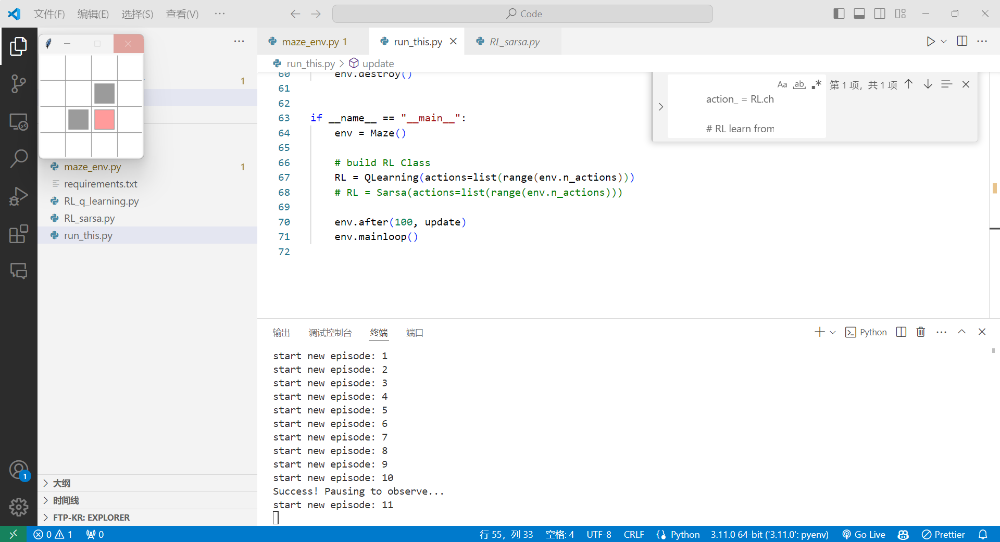
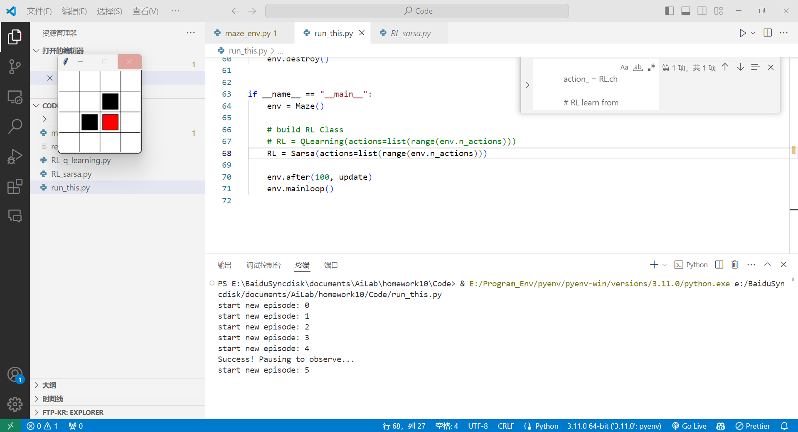

# 人工智能实验报告 实验作业11

<center>姓名:胡瑞康 学号:22336087</center>

## 一.实验题目

你将针对来自**`OpenAI Gym`**的迷宫环境实现Sarsa和Q-learning算法。我们提供了该环境的定制版本。在这个场景中，一个红色矩形（代理）在由$4\times4$网格构成的迷宫中初始化，并且只能观察到其位置。在每个时间步，代理可以移动到四个相邻网格中的一个。如果代理位于黄色网格上，则奖励为+1；如果代理到达黑色网格，则奖励为-1；否则奖励为0。

1. <strong>(编码)</strong> 在`RL_sarsa.py`中实现**Sarsa**。

2. <strong>(编码)</strong> 在**`RL_q_learning.py`**中实现**Q-learning**。

## 二.实验内容

### 1. 算法原理


#### Q-learning
Q-learning是一种无模型强化学习算法。它通过学习状态-动作值函数(Q表)来估计在某一状态下采取某一动作的预期回报。算法更新规则如下：

$$
Q(s, a) \leftarrow Q(s, a) + \alpha [r + \gamma \max_{a'} Q(s', a') - Q(s, a)]
$$

其中，$\alpha$是学习率，$\gamma$是折扣因子，$r$是即时奖励，$s'$是下一状态，$\max_{a'} Q(s', a')$表示在下一状态下选择最优动作的预期回报。

#### Sarsa
Sarsa是一种基于策略的强化学习算法。与Q-learning不同，Sarsa依赖于具体的策略选择下一个动作。算法更新规则如下：

$$
Q(s, a) \leftarrow Q(s, a) + \alpha [r + \gamma Q(s', a') - Q(s, a)]
$$

其中，$a'$是根据当前策略选择的下一个动作。

### 2. 创新点&优化

在本实验中，我们对Q-learning和Sarsa算法进行了一些优化，以提高其在迷宫环境中的学习效率：

1. **探索率衰减**：为了在训练过程中逐渐减少随机探索的频率，我们实现了一个动态的探索率衰减机制。随着训练的进行，$\epsilon$值逐渐减小，从而使代理更频繁地选择最优动作。
  
2. **状态空间离散化**：由于环境中的状态是连续的（坐标值），我们通过将状态坐标离散化为离散状态标签，从而减少状态空间的复杂度。


### 3. 代码展示

#### Q-learning 代码片段与解释

```python
class QLearning:
    def __init__(self, actions, learning_rate=0.01, reward_decay=0.9, e_greedy=0.1):
        self.actions = actions  # 动作列表
        self.lr = learning_rate  # 学习率
        self.gamma = reward_decay  # 奖励衰减率
        self.epsilon = e_greedy  # 探索率
        self.q_table = pd.DataFrame(columns=self.actions, dtype=np.float64)  # 初始化 Q 表

    def choose_action(self, observation):
        self.check_state_exist(observation)
        if np.random.uniform() < self.epsilon:
            state_action = self.q_table.loc[observation, :]
            action = np.random.choice(state_action[state_action == np.max(state_action)].index)
        else:
            action = np.random.choice(self.actions)
        return action

    def learn(self, s, a, r, s_):
        self.check_state_exist(s_)
        q_predict = self.q_table.loc[s, a]
        if s_ != 'terminal':
            q_target = r + self.gamma * self.q_table.loc[s_, :].max()
        else:
            q_target = r
        self.q_table.loc[s, a] += self.lr * (q_target - q_predict)
```

在上述代码中，Q-learning算法通过Q表格来记录每个状态-动作对的值。`choose_action`方法根据当前状态选择一个动作，通过$\epsilon$-贪婪策略在探索和利用之间进行权衡。`learn`方法根据经验更新Q表格中的值，从而不断改进策略。

#### Sarsa 代码片段与解释

```python
class Sarsa:
    def __init__(self, actions, learning_rate=0.01, reward_decay=0.9, e_greedy=0.9):
        self.actions = actions  # 动作列表
        self.lr = learning_rate  # 学习率
        self.gamma = reward_decay  # 奖励衰减率
        self.epsilon = e_greedy  # 探索率
        self.q_table = pd.DataFrame(columns=self.actions, dtype=np.float64)  # 初始化 Q 表

    def choose_action(self, observation):
        self.check_state_exist(observation)
        if np.random.uniform() < self.epsilon:
            state_action = self.q_table.loc[observation, :]
            action = np.random.choice(state_action[state_action == np.max(state_action)].index)
        else:
            action = np.random.choice(self.actions)
        return action

    def learn(self, s, a, r, s_, a_):
        self.check_state_exist(s_)
        q_predict = self.q_table.loc[s, a]
        if s_ != 'terminal':
            q_target = r + self.gamma * self.q_table.loc[s_, a_]
        else:
            q_target = r
        self.q_table.loc[s, a] += self.lr * (q_target - q_predict)
```

在上述代码中，Sarsa算法同样通过Q表格来记录每个状态-动作对的值。`choose_action`方法与Q-learning相似，通过$\epsilon$-贪婪策略在探索和利用之间进行权衡。`learn`方法根据当前经验更新Q表格中的值，但不同的是，Sarsa算法在更新过程中考虑了实际选择的下一个动作，从而使得策略更加平滑和稳定。


## 三.实验结果及分析

### 1. 实验结果展示

如图所示，Q网络和Sarsa均可走到终点


- **Q-learning**：在每个状态下选择最优动作，能够快速收敛到较优策略。由于其基于状态-动作值函数的最大值选择，能够在大多数情况下较快地找到到达终点的路径。1




- **Sarsa**：依赖于当前策略选择动作，更新过程中考虑了实际执行的动作，策略较为平滑，能够在一定程度上减少陷入局部最优的风险。


