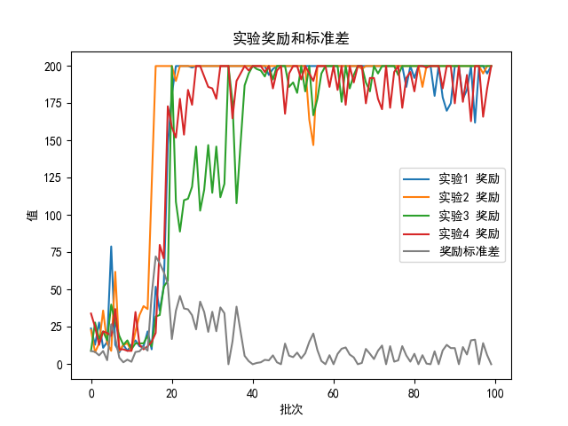

# 人工智能实验报告 实验作业11

<center>姓名:胡瑞康 学号:22336087</center>

## 实验题目

### 实现DQN算法

在`CartPole-v0`环境中实现DQN算法。最终算法性能的评判标准：以算法收敛的reward大小、收敛所需的样本数量给分。 reward越高（至少是180，最大是200）、收敛所需样本数量越少，分数越高。 

### Submission

作业提交内容：需提交一个zip文件，包括代码以及实验报告PDF。实验报告除了需要写writing部分的内容，还需要给出reward曲线图以及算法细节。

## 实验内容

### 算法介绍

DQN（Deep Q-Network）算法是一种结合了深度学习和强化学习的算法。其核心思想是使用神经网络来逼近Q值函数，从而解决传统Q-learning算法在高维状态空间下无法有效工作的瓶颈。DQN通过以下几个关键技术来实现：

- 使用神经网络作为Q值函数的逼近器。
- 经验回放缓冲区（Replay Buffer）用于存储训练数据，打破数据相关性。
- 目标网络（Target Network）用于稳定训练过程。

DQN算法的更新步骤如下：
1. 从经验回放缓冲区中随机抽取一个小批量（mini-batch）的经验数据。
2. 通过神经网络计算当前状态的Q值。
3. 使用目标网络计算下一个状态的Q值，并计算目标Q值。
4. 使用均方误差（MSE）损失函数计算误差并进行反向传播更新网络参数。
5. 定期更新目标网络。


### 代码展示与分析

#### Q网络

```python
class QNetwork(nn.Module):
    # 初始化函数，接收输入大小、隐藏层大小和输出大小作为参数
    def __init__(self, input_size, hidden_size, output_size):
        # 调用父类的初始化方法
        super(QNetwork, self).__init__()
        self.fc1 = nn.Linear(input_size, hidden_size)
        self.fc2 = nn.Linear(hidden_size, hidden_size)
        self.output = nn.Linear(hidden_size, output_size)

    # 定义前向传播函数，接收输入数据
    def forward(self, inputs):
        x = torch.relu(self.fc1(inputs))
        x = torch.relu(self.fc2(x))
        return self.output(x)
```

Q网络由两个全连接层（fully connected layers）和一个输出层组成，每个全连接层后面紧跟一个ReLU激活函数。

其结构如下所示：
- **输入层（Input Layer）**: 接收状态的特征向量作为输入，其大小为`input_size`。
- **隐藏层（Hidden Layers）**: 两个全连接层，每层大小为`hidden_size`，采用ReLU激活函数。
- **输出层（Output Layer）**: 最终输出动作空间的Q值，大小为`output_size`，无激活函数。

使用参数`"hidden_size": 128`

#### 经验回放
```python
class ReplayBuffer:
    def __init__(self, buffer_size):
        self.buffer_size = buffer_size
        # 创建一个双端队列，其最大长度为buffer_size
        self.buffer = deque(maxlen=buffer_size)

    def __len__(self):
        # 返回双端队列的长度，即缓冲区中元素的数量
        return len(self.buffer)

    def push(self, *transition):
        # 将经验数据添加到双端队列的末尾
        self.buffer.append(transition)

    def sample(self, batch_size):
        # 从双端队列中随机抽取batch_size个元素
        return random.sample(self.buffer, batch_size)
```

经验回放通过缓存智能体与环境交互产生的经验数据，以解决传统强化学习算法中的数据相关性和样本选择偏差问题。其核心思想是将每次交互的状态转移（state transition）以元组形式保存在缓冲区中，并随机抽样用于训练神经网络模型，从而打破数据的时序相关性，增强训练的稳定性和效率。

1. **初始化（`__init__`方法）**：
   - `buffer_size`: 设定缓冲区的最大容量，即能存储的经验元组数量。
   - `self.buffer`: 使用Python标准库`deque`实现的双端队列，用于存储经验数据，具备自动限制最大长度的特性。

2. **数据存储与管理**：
   - `push`方法：接收一个或多个元组（通常为状态、动作、奖励、下一个状态、完成标志等）作为参数，将这些经验数据添加到双端队列的末尾。
   - `sample`方法：从双端队列中随机抽样出指定数量的经验元组，用于训练过程中的批量学习。

3. **其他方法**：
   - `__len__`方法：返回当前双端队列中存储的经验元组数量，方便控制缓冲区的使用和状态。

#### Agent模块

##### 初始化

```python
class AgentDQN(Agent):
.....
    def __init__(self, env, args):
        super(AgentDQN, self).__init__(env)
        self.env = env
        self.args = args
        self.all_rewards = [] 

        # 设置随机种子
        self.seed = args.seed
        torch.manual_seed(self.seed)
        np.random.seed(self.seed)
        random.seed(self.seed)

        # 初始化经验回放缓冲区和Q网络
        self.replay_buffer = ReplayBuffer(buffer_size=args.buffer_size)
        self.q_network = QNetwork(env.observation_space.shape[0], args.hidden_size, env.action_space.n)
        self.target_q_network = copy.deepcopy(self.q_network)

        # 初始化优化器、学习率调度器和损失函数
        self.lr_min = args.lr_min
        self.optimizer = optim.Adam(self.q_network.parameters(), lr=args.lr)
        self.scheduler = optim.lr_scheduler.StepLR(self.optimizer, step_size=args.lr_decay_freq, gamma=args.lr_decay)
        self.loss_fn = nn.MSELoss()
        
        # 初始化参数
        self.gamma = args.gamma  # 折扣因子
        self.batch_size = args.batch_size  # 批大小
        # 更新目标网络的频率
        self.update_target_freq = args.update_target_freq
        # epsilon贪心策略的epsilon值
        self.epsilon = args.epsilon
        # epsilon贪心策略的最小epsilon值
        self.epsilon_min = args.epsilon_min
        self.epsilon_decay = args.epsilon_decay
        # 设置日志目录
        self.log_dir = './logs'
        os.makedirs(self.log_dir, exist_ok=True)
        # 记录一局的奖励
        self.episode_rewards = 0
.....
```

该模块通过设置随机种子，接收 `env` , `args` 来初始化各种参数

##### 更新Q网络

```python
class AgentDQN(Agent):
.....
def update_q_network(self):
        # 从经验回放缓冲区中采样
        state, action, reward, next_state, done = zip(*self.replay_buffer.sample(self.batch_size))

        # 将采样数据转换为张量
        state = torch.FloatTensor(np.array(state))
        action = torch.LongTensor(action)
        reward = torch.FloatTensor(reward)
        next_state = torch.FloatTensor(np.array(next_state))
        done = torch.FloatTensor(done)

        # 计算当前Q值和下一个状态的Q值
        q_values = self.q_network(state)
        next_q_values = self.target_q_network(next_state)

        q_value = q_values.gather(1, action.unsqueeze(1)).squeeze(1)
        next_q_value = next_q_values.max(1)[0]
        expected_q_value = reward + self.gamma * next_q_value * (1 - done)

        # 计算损失并更新网络
        loss = self.loss_fn(q_value, expected_q_value.detach())
        self.optimizer.zero_grad()
        loss.backward()
        self.optimizer.step()
.....
```
主要流程如下：
1. **经验回放缓冲区采样**: 从经验回放缓冲区中随机抽取一批经验数据。这种随机抽样的方式有助于打破数据之间的相关性，提高训练效率和稳定性。

2. **数据转换与处理**: 将抽样的状态（state）、动作（action）、奖励（reward）、下一个状态（next_state）和结束标志（done）转换为PyTorch张量，以便于后续的神经网络计算和梯度优化。

3. **计算Q值和目标Q值**: 使用当前Q网络计算当前状态的Q值，并利用目标网络计算下一个状态的Q值。这里的目标Q值通过Bellman方程计算得到，结合了即时奖励和未来预期奖励。

4. **计算损失函数与优化网络**: 使用均方误差（MSE）损失函数计算当前Q值与目标Q值之间的差异，并执行反向传播算法来更新Q网络的参数。优化器（Optimizer）根据计算得到的梯度调整网络权重，从而最小化损失函数。

5. **更新目标网络**: 定期更新目标网络，即将当前Q网络的参数复制给目标Q网络。这一步骤有助于提高算法的稳定性，减少训练过程中的波动和震荡。

##### 动作执行

```python
class AgentDQN(Agent):
.....
    def make_action(self,state):
        # 根据epsilon选择动作
        if random.random() > self.epsilon:
            # 使用Q网络选择动作
            state_tensor = torch.FloatTensor(state).unsqueeze(0)
            with torch.no_grad():
                action = self.q_network(state_tensor).max(1)[1].item()
        else:
            # 随机选择动作
            action = self.env.action_space.sample()
        return action
.....
```

实现了基于epsilon-贪心策略的动作选择

**epsilon值的影响**: epsilon值控制了Agent在选择动作时探索与利用的权衡。当epsilon较大时，Agent更倾向于随机选择动作，以便更好地探索环境，发现潜在的高奖励策略；当epsilon较小时，Agent更倾向于根据当前学习到的Q值函数选择最优动作，以提高长期累积奖励。

**利用Q网络选择动作**: 当random.random() > self.epsilon时，Agent利用当前学习到的Q网络选择动作。具体步骤是将当前状态state转换为Tensor格式，然后通过Q网络计算每个动作的Q值，并选择Q值最大的动作作为当前状态下的最优动作。

**随机选择动作**: 当random.random() <= self.epsilon时，Agent随机从环境的动作空间中选择一个动作。这种随机选择有助于在学习过程中避免陷入局部最优解，增加探索环境的机会，从而可能发现更优的策略。
##### 记忆模块

```python
class AgentDQN(Agent):
.....
    def remember(self, state, action, reward, next_state, done):
        self.replay_buffer.push(state, action, reward, next_state, done)
        # 经验回放缓冲区中的经验数据足够，更新Q网络
        if len(self.replay_buffer) > self.batch_size:
            self.update_q_network()
            # 更新epsilon值
            if self.epsilon > self.epsilon_min:
                self.epsilon *= self.epsilon_decay
            else:
                self.epsilon = self.epsilon_min
            # 更新学习率
            if self.scheduler.get_last_lr()[0] > self.lr_min:
                self.scheduler.step()
.....
```
具体流程：
1. **存储经验**：
   - `self.replay_buffer.push(state, action, reward, next_state, done)`：将当前状态 `state`、动作 `action`、奖励 `reward`、下一个状态 `next_state` 和结束标志 `done` 存储到经验回放缓冲区中。经验回放缓冲区用于存储训练中的经验数据，以打破样本数据的相关性，提升训练效果。

2. **更新Q网络**：
   - `if len(self.replay_buffer) > self.batch_size:`：当经验回放缓冲区中的经验数据量超过设定的批大小时，执行以下操作：
     - `self.update_q_network()`：调用 `update_q_network` 方法更新Q网络。具体操作包括从经验回放缓冲区中随机采样一批数据，计算Q值，并使用反向传播更新神经网络的参数。这一步骤是DQN算法中的关键，用于优化Q网络，使其能够更好地逼近最优Q值函数。

3. **动态调整epsilon值**：
   - `if self.epsilon > self.epsilon_min:`：如果当前的epsilon值大于设定的最小epsilon值 `epsilon_min`，则执行以下操作：
     - `self.epsilon *= self.epsilon_decay`：将当前epsilon值乘以衰减因子 `epsilon_decay`，以逐步减小epsilon值。epsilon值控制了agent在训练过程中探索与利用的权衡，随训练进行逐渐降低，使得agent更多地利用已学习到的经验来选择动作，从而提高训练效率和稳定性。

4. **调整学习率**：
   - `self.scheduler.step()`：调用学习率调度器 `scheduler` 的 `step` 方法，根据设定的策略调整当前优化器的学习率。学习率的调整策略可以根据实际问题和经验进行设定，通常是在一定步数或帧数后进行衰减，以优化训练过程的收敛速度和稳定性。

##### 模型训练

```python
class AgentDQN(Agent):
.....
    def train(self):
        state, _ = self.env.reset()
        step = 0
        for frame_idx in range(1, self.args.n_frames + 1):
            done = False
            self.episode_rewards = 0
            while not done:
                step += 1
                # 随机选择动作
                action = self.make_action(state)
                # 执行动作
                next_state, reward, terminated, truncated, _ = self.env.step(action)
                done = terminated or truncated
                # 记忆
                self.remember(state, action, reward, next_state, done)
                state = next_state
                self.episode_rewards += reward
                # 每隔一定轮数更新目标网络
                if step % self.update_target_freq == 0:
                    self.update_target_network()
                # 如果当前episode结束，重置环境
                if done:
                    self.all_rewards.append(self.episode_rewards)
                    state, _ = self.env.reset()
                    print(f"{frame_idx} reward {self.episode_rewards} epsilon {self.epsilon} step {step}")
                    break
            #循环外部
.....
```
主要流程：
1. **初始化和重置**：
   - `state, _ = self.env.reset()`：初始化环境并获取初始状态。
   - `step = 0`：初始化步数计数器。

2. **训练循环**：
   - `for frame_idx in range(1, self.args.n_frames + 1):`：按照设定的训练帧数进行迭代。
   - `done = False`：标志当前episode是否结束。
   - `self.episode_rewards = 0`：初始化当前episode的累积奖励。

3. **执行动作和更新**：
   - `while not done:`：在当前episode结束前执行以下操作。
   - `action = self.make_action(state)`：根据epsilon-贪心策略选择动作。
   - `next_state, reward, terminated, truncated, _ = self.env.step(action)`：执行选定的动作并获取下一个状态、奖励等信息。
   - `done = terminated or truncated`：判断当前episode是否结束。
   - `self.remember(state, action, reward, next_state, done)`：将经验存储到经验回放缓冲区中。
   - `state = next_state`：更新状态为下一个状态。
   - `self.episode_rewards += reward`：累加当前episode的奖励。

4. **更新目标网络**：
   - `if step % self.update_target_freq == 0:`：每隔一定步数更新目标网络，以提高训练稳定性和效果。

5. **结束当前episode**：
   - `if done:`：如果当前episode结束，则执行以下操作。
   - `self.all_rewards.append(self.episode_rewards)`：将当前episode的累积奖励添加到总奖励列表中。
   - `state, _ = self.env.reset()`：重置环境并获取初始状态。
   - `print(f"{frame_idx} reward {self.episode_rewards} epsilon {self.epsilon} step {step}")`：打印当前帧数、奖励、epsilon值和步数信息。
   - `break`：结束当前episode的循环。
## 实验结果及分析

### 实验结果展示


为了保证数据结果可靠与容易观察，使用4个五位随机数作为种子测试

```
11038, 63415, 81247, 31472
```

得到奖励曲线与均方差如图下所示：



### 实验结果分析

由图可知，大约20-40批次（取决于种子）可以很快达到200。

这是由于较大的隐藏层`hidden_size:128`，以及对应合理的`batch_size:128`得以快速训练到较好的模型。

之后经过约20批次可以稳定收敛到200，标准差小于25，在100批以内得到较稳定的模型。

本次实验通过如下方法提高了收敛稳定性：

- 学习率衰减:
    在Q网络每更新`"lr_decay_freq": 500`次后进行`"lr_decay": 0.9`指数衰减，最低学习率为`"lr_min": 5e-4`
- epsilon衰减：
    由于初期经验为空，所以设置`"epsilon": 1.0`保证纯随机选择动作，后期积累足够经验可以较大概率从经验回放中抽取，最低epsilon为`"epsilon_min": 5e-4。`