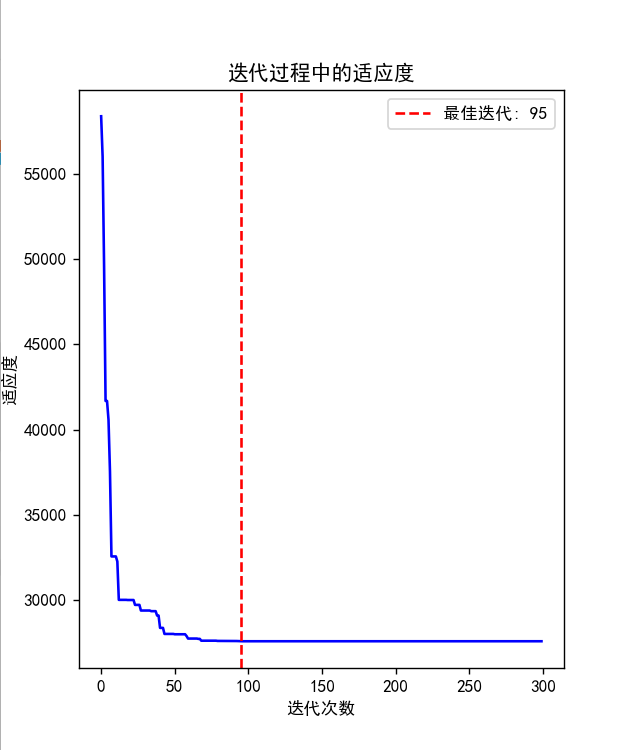

# 人工智能实验报告 实验作业4

姓名:胡瑞康 学号:22336087

## 一.实验题目


### 遗传算法解决TSP问题

为了方便批改作业, 我们统一用类 `GeneticAlgTSP`来编写遗传算法的各个模块, 并分析算法性能. 该类需包含以下方法:

* 构造函数 `__init__()`, 输入为TSP数据集文件名 `filename`, 数据类型 `str`. 例如 `"dj38.tsp"`是Djibouti的38个城市坐标数据文件; `"ch71009.tsp"`是China的71009个城市坐标数据文件. 我们需要在构造函数中读取该文件中的数据, 存储到类成员 `self.cities`中(数据类型自定, 建议存储为 `numpy`数组). 同时在构造函数中初始化种群, 存储到类成员 `self.population`中(数据类型自定).
* 求解方法 `iterate()`, 输入为算法迭代的轮数 `num_iterations`, 数据类型 `int`. 该方法是基于当前种群 `self.population`进行迭代(不是从头开始), 返回迭代后种群中的一个较优解, 数据类型 `list`, 格式为1-n个城市编号的排列. 例如, 对于n=5的TSP问题, 迭代后返回的较优解形如 `[1,3,4,5,2]`, 表示当前较好的游览城市次序为1-3-4-5-2-1.

可以在类中编写其他方法以方便编写并分析遗传算法的性能. 请在代码注释或实验报告中说明每个方法/模块的功能.

### 提示

1. 数据集来源于网站[National Traveling Salesman Problems (uwaterloo.ca)](https://www.math.uwaterloo.ca/tsp/world/countries.html). 可浏览该网站参考相关国家的TSP问题的解. 可以自选1-2个数据集来测试算法性能, 并在实验报告中说明.
2. TSP问题上遗传算法的具体实现(解的表示, 染色体交叉操作等)不一定局限于课件上的方式, 也许存在比课件效果更好的具体实现方法.
3. 由于遗传算法是基于随机搜索的算法, 只运行一次算法的结果并不能反映算法的性能. 为了更好地分析遗传算法的性能, 应该以不同的初始随机种子或用不同的参数(例如种群数量, 变异概率等)多次运行算法, 这些需要在实验报告中呈现.
4. 最后提交的代码只需包含性能最好的实现方法和参数设置. 只需提交一个代码文件, 请不要提交其他文件.
5. 对于规模较大的TSP问题, 遗传算法可能需要运行几分钟甚至几个小时的时间才能得到一个比较好的结果. 因此建议先用城市数较小的数据集测试算法正确与否, 再用城市数较大的数据集来评估算法性能.
6. 本次作业可以使用 `numpy`库以及python标准库. 有余力的同学可用 `matplotlib`库对遗传算法的结果进行可视化处理与分析, 并在实验报告中呈现.

## 二.实验内容

### 1. 算法原理

遗传算法是一种模拟自然选择和遗传学原理的搜索算法。它通过模拟“适者生存，不适者淘汰”的自然进化过程，来解决优化和搜索问题。算法的基本步骤包括初始化种群、评估适应度、选择、交叉（配对）、变异以及代代传递直至满足终止条件。

- **初始化种群**：随机生成一组解作为初始种群。在TSP问题中，种群中的每个个体代表一种城市的访问序列。
- **评估适应度**：通过适应度函数评价每个个体的适应程度，即该访问序列的总旅行距离。适应度高的个体更有可能被选中进行下一代的繁衍。
- **选择**：基于个体的适应度，从当前种群中选择个体进入下一代。常用的选择方法有轮盘赌选择和锦标赛选择等。
- **交叉**：随机选择两个个体作为父母，按照一定规则交换他们的部分基因，产生新的后代。这一过程模拟了生物的交配过程。
- **变异**：以一定的概率随机改变个体中的某些基因，引入新的遗传变异，增加种群的多样性。
- **新一代种群的生成**：通过选择、交叉和变异操作生成新一代种群，重复执行以上步骤直至满足终止条件，如达到最大迭代次数或找到满意度足够高的解。

### 2. 创新点&优化


#### 使用Numba加速运算

在遗传算法中，计算适应度是重复且计算密集型的过程，特别是当处理大规模问题如TSP时。本实验采用Numba库对计算适应度的函数进行加速。Numba是一个开源JIT编译器，将Python函数转换成优化的机器码。通过为计算适应度的函数添加`@numba.jit`装饰器，显著提高了函数的执行效率。

#### 使用Pyplot可视化图表展示

为了直观展示遗传算法在解决TSP问题过程中的性能，本实验使用Matplotlib库中的Pyplot进行数据可视化。通过绘制迭代过程中最佳适应度值的变化曲线，可以直观地观察算法的收敛情况和性能。此外，还可以展示算法找到的最佳路径，直观地展示城市访问序列，为算法性能的分析提供直观依据。


#### 选择合适的随机种子

```python
# 测试不同的突变率
def test_seed():
    filename = "E:\\BaiduSyncdisk\\文档类\\AiLab\\homework5\\Code\\dj38.tsp"
    iterations = 300
    # 0.1-0.8 list
    mutation_rates = [i / 10 for i in range(6, 9)]
    # population sizes 100-1000
    population_sizes = [i for i in range(600, 1100, 100)]
    results = {}
    best_rate = None
    best_fitness = None
    best_size = None  # 跟踪最佳种群大小
    ga_tsp = GeneticAlgTSP(filename)
    for size in population_sizes:
        for rate in mutation_rates:
            ga_tsp.set(mutation_rate=rate, population_size=size)
            best_path, best_iteration, best_ever_fitness, run_time = ga_tsp.iterate(iterations)
            results[(size, rate)] = {  # 将种群大小和变异率作为键
                "best_path": best_path,
                "best_iteration": best_iteration,
                "best_ever_fitness": best_ever_fitness,
                "run_time": run_time
            }
            if best_fitness is None or best_ever_fitness > best_fitness:
                best_rate = rate
                best_fitness = best_ever_fitness
                best_size = size  # 更新最佳种群大小
    print_results(best_size, best_rate, best_fitness)  # 打印最佳种群大小和变异率

def print_results(size, rate, best_fitness):
    print(f"种群数量: {size}, 变异率: {rate}, 最佳适应度: {best_fitness}")
```
通过上面的代码，对变异率，种群数量在一定范围内对小样本测试。

最终得到`600`的种群数量，`0.6`的变异率效果较好

### 3.代码展示

#### 适应度计算

使用Numba库优化了适应度计算的过程。在TSP问题中，适应度是通过计算一个路径的总长度来评估的，目标是找到总长度最短的路径。为了提高计算效率，我对适应度计算函数使用@numba.jit(nopython=True)装饰器，这使得Python代码能够被编译成机器级别的代码，极大地加快了计算速度。


```python
@numba.jit(nopython=True)
def calculate_fitness_numba(cities, individual):
    distance = 0.0
    size = len(individual)
    for i in range(size):
        idx1, idx2 = individual[i], individual[(i + 1) % size]
        city1, city2 = cities[idx1], cities[idx2]
        distance += np.sqrt((city1[0] - city2[0]) ** 2 + (city1[1] - city2[1]) ** 2)
    return distance
```

#### 变异过程

在变异部分，实现了倒置变异策略，通过随机选择路径上的两点并将这两点间的序列倒置，从而引入新的变异。这种变异方式对TSP问题特别适用，因为它可以在不破坏路径基本结构的情况下引入变化。也使用了Numba来加速变异过程的执行。


```python
@numba.njit
# 变异过程
def mutate(individual: np.ndarray) -> np.ndarray:
    """
    对个体执行倒置变异操作。
    :param individual: 待变异的个体。
    :return: 变异后的个体。
    """

    # 创建一个 Numba 随机数生成器
    def custom_random_sample(length):
        return np.random.choice(np.arange(length), size=2, replace=False)

    # 随机选择两个不同的下标
    idx1, idx2 = sorted(custom_random_sample(len(individual)))

    # 执行变异操作
    individual[idx1: idx2 + 1] = individual[idx1: idx2 + 1][::-1]

    return individual
```

#### 交叉过程

对于交叉过程，选择了顺序构造交叉算法。这种算法通过保留父本中的某些城市序列并尝试结合两个父本的特性来构造子代。在实现中特别注意保持了路径的有效性，避免了产生无效的城市访问序列。


```python
# 顺序构造交叉算法
@numba.jit(nopython=True)
def sequential_constructive_crossover(cities, parent1, parent2):
    num_cities = cities.shape[0]
    child = np.full(num_cities, -1, dtype=np.int32)  # 初始化子代
    in_child = np.zeros(num_cities, dtype=np.bool_)  # 跟踪城市是否已在子代中

    # 建立从城市到其在parent1和parent2中位置的映射
    parent1_pos = np.empty(num_cities, dtype=np.int32)
    parent2_pos = np.empty(num_cities, dtype=np.int32)
    for i in range(num_cities):
        parent1_pos[parent1[i]] = i
        parent2_pos[parent2[i]] = i

    child[0] = parent1[0]
    in_child[parent1[0]] = True

    for i in range(1, num_cities):
        current_city = child[i - 1]
        index1 = parent1_pos[current_city]
        index2 = parent2_pos[current_city]

        # 确定两个潜在的下一个城市
        next_city1 = parent1[(index1 + 1) % num_cities]
        next_city2 = parent2[(index2 + 1) % num_cities]

        if in_child[next_city1] and in_child[next_city2]:
            # 如果两个潜在的下一个城市都已经在子代中，寻找下一个未使用的城市
            for city in range(num_cities):
                if not in_child[city]:
                    next_city = city
                    break
        else:
            # 选择两个潜在城市中未被添加且距离当前城市较近的城市
            if not in_child[next_city1] and not in_child[next_city2]:
                dist1 = np.sqrt((cities[current_city][0] - cities[next_city1][0]) ** 2 + (
                        cities[current_city][1] - cities[next_city1][1]) ** 2)
                dist2 = np.sqrt((cities[current_city][0] - cities[next_city2][0]) ** 2 + (
                        cities[current_city][1] - cities[next_city2][1]) ** 2)
                next_city = next_city1 if dist1 < dist2 else next_city2
            elif not in_child[next_city1]:
                next_city = next_city1
            else:
                next_city = next_city2

        child[i] = next_city
        in_child[next_city] = True

    return child
```

#### 选择过程

在选择机制中，对比了轮盘赌选择，排序选择和锦标赛选择两种方法。

实验表明，排序选择在多数情况下能够更好地提升算法的性能，可能是因为它直接基于适应度来选择个体，更倾向于选出优质的个体进行繁衍。


```python
# 使用轮盘赌选择方法选择下一代个体
def rw_selection(population, fitnesses, population_size):
    # 对适应度进行归一化处理
    fitnesses /= fitnesses.sum()
    selected_indices = np.random.choice(
        np.arange(len(population)), size=population_size, replace=True, p=fitnesses
    )
    # 根据选择的索引构建选择后的种群
    return [population[i] for i in selected_indices]
#排名选择
@numba.jit(nopython=True)
def sorted_selection(population, fitnesses, population_size):
    # 根据适应度进行排序，获取排序后的索引
    sorted_indices = np.argsort(fitnesses)

    # 选择适应度最好的个体，这里假设是最小化问题
    selected_indices = sorted_indices[:population_size]

    # 根据选择的索引构建选择后的种群
    return [population[i] for i in selected_indices]
@jit(nopython=True)
def tournament_selection(population, fitnesses, population_size):
    """
    使用锦标赛选择算法选择下一代个体。
    
    :param population: 当前种群的数组。
    :param fitnesses: 种群个体的适应度数组。
    :param population_size: 种群大小，即选择出的个体数量。
    :return: 新一代的种群数组。
    """
    tournament_size = population_size // 4  # 锦标赛的大小
    # 初始化一个空数组来存储选择出的个体
    selected_indices = np.zeros(population_size, dtype=np.int32)
    for i in range(population_size):
        # 随机选择tournament_size个个体进行锦标赛
        participants = np.random.randint(0, len(population), tournament_size)
        # 选择出这些个体中适应度最好的个体
        best_participant = participants[np.argmin(fitnesses[participants])]
        # 将最佳个体加入到选择出的种群中
        selected_indices[i] = best_participant
    # 返回根据选择的索引构建的新一代种群
    return population[selected_indices]
```
#### 核心类
在实现遗传算法解决TSP问题的核心类`GeneticAlgTSP`中，详细定义了算法的关键组成部分，包括初始化、适应度计算、选择、交叉和变异操作，以及通过迭代寻找最优解的过程。

##### 初始化过程

通过构造函数`__init__`初始化算法实例，输入参数包括TSP数据集的文件名、种群大小和变异率。在此阶段，首先读取城市坐标数据并存储至`cities`数组，然后根据城市数量初始化种群，每个个体代表一个可能的城市访问序列。

##### 读取城市数据

`read_tsp_data`方法负责从文件中读取城市坐标。通过解析标准的TSP数据文件，提取每个城市的坐标并将其保存为NumPy数组，为之后计算个体适应度提供基础。

##### 初始化种群

`initialize_population`方法生成初始种群。通过为每个城市分配一个唯一的编号，然后随机打乱这些编号，为每个个体创建一个随机的访问序列。这一步骤确保了初始种群具有足够的多样性。

##### 交叉过程

在`crossover`方法中，采用顺序构造交叉算法生成后代。该方法试图结合两个父代个体的特征，生成保留了两者优良属性的子代。通过细致地设计交叉规则，有效地维护了TSP路径的有效性和连续性。

##### 迭代过程

`iterate`方法控制算法的主要迭代过程。在每一轮迭代中，先通过适应度计算为当前种群中的每个个体评分，然后执行选择操作以决定哪些个体能够进入下一代。之后，对选中的个体进行交叉和变异操作，以生成新的种群。此外，利用多进程技术并行处理交叉和变异过程，显著提升了算法的执行效率。每次迭代后，记录当前找到的最优解和对应的适应度值，直到完成指定次数的迭代。


```python
class GeneticAlgTSP:
    # 初始化遗传算法类
    def __init__(
            self, filename: str, population_size=600, mutation_rate=0.6
    ):
        # 备份0.72 0.027
        """
        初始化遗传算法解决TSP问题的类。
        :param filename: 包含城市坐标的文件名。
        :param population_size: 种群的大小。
        :param mutation_rate: 变异率。
        """
        self.fitness_history = []
        self.cities = self.read_tsp_data(filename)
        self.population_size = population_size
        # 初始化种群
        self.population = self.initialize_population()
        # 定义交叉率和变异率
        self.mutation_rate = mutation_rate

    def set(self, population_size=1000, mutation_rate=0.65):
        self.fitness_history = []
        self.population_size = population_size
        self.mutation_rate = mutation_rate

    # 从文件读取城市坐标
    def read_tsp_data(self, filename: str):
        """
        从文件中读取TSP城市的坐标。
        :param filename: 文件名。
        :return: 城市坐标的numpy数组。
        """
        cities = np.empty((0, 2), dtype=float)  # 创建一个空的NumPy数组
        with open(filename, "r") as f:
            lines = f.readlines()
            in_node_coord_section = False
            for line in lines:
                line = line.strip()
                if line.startswith("NODE_COORD_SECTION"):
                    in_node_coord_section = True
                elif in_node_coord_section and line:
                    parts = line.split()
                    if len(parts) >= 3:
                        city_coord = np.array([[float(parts[1]), float(parts[2])]])  # 创建一个包含城市坐标的NumPy数组
                        cities = np.vstack((cities, city_coord))  # 将城市坐标添加到NumPy数组中
                elif line.startswith("EOF"):
                    break
        return cities

    # 初始化种群
    def initialize_population(self) -> np.ndarray:
        """
        初始化种群，每个个体代表一种城市访问的路径。
        :return: 初始化的种群。
        """
        population = np.empty((self.population_size, len(self.cities)), dtype=int)  # 创建一个空的 NumPy 数组来存储种群
        for i in range(self.population_size):
            individual = np.arange(len(self.cities))  # 创建一个顺序的城市索引数组
            np.random.shuffle(individual)  # 打乱顺序，生成一个随机的个体
            population[i] = individual  # 将个体添加到种群中
        return population

    def crossover(self, parent1: np.ndarray, parent2: np.ndarray) -> np.ndarray:
        return sequential_constructive_crossover(self.cities, parent1, parent2)

    # 迭代过程
    def iterate(self, num_iterations: int):
        """
        进行指定次数的迭代，优化路径。
        :param num_iterations: 迭代次数。
        :return: 最佳路径。
        """
        start_time = time.time()  # 记录开始时间
        best_ever_individual = None  # 最佳个体
        best_ever_fitness = float("+inf")  # 最佳个体的适应度
        best_iteration = 0  # 最佳迭代次数
        with Pool(processes=16) as pool:
            # 开始迭代
            for iteration in range(num_iterations):
                single_start_time = time.time()  # 记录开始时间
                # 选择下一代个体
                if len(self.population) > self.population_size:
                    fitnesses = np.zeros(len(self.population))
                    for i, individual in enumerate(self.population):
                        # 单个个体的适应度计算
                        fitnesses[i] = calculate_fitness_numba(
                            self.cities, individual
                        )
                    new_population_indices = sorted_selection(
                        np.arange(len(self.population)), fitnesses, self.population_size
                    )
                    # 直接使用索引获取新种群
                    new_population = self.population[new_population_indices]
                else:
                    new_population = self.population
                show_run_time(single_start_time, f"{iteration}选择操作")
                next_generation = []

                # 交叉、变异，并计算适应度，同时保留变异前后的child
                # 生成任务参数列表
                size = len(new_population)
                tasks = [(self.cities, new_population[i],
                          new_population[(i + 1) % size],
                          self.mutation_rate) for i in range(0, size, 2)]

                # 使用pool.map并行处理任务
                results = pool.map(process_individual, tasks)
                # 处理结果
                next_generation = []
                # 复制父本
                for i in range(0, size, 2):
                    next_generation.append(new_population[i])
                    next_generation.append(new_population[(i + 1) % size])
                for child, original_child_fitness, mutated_child, mutated_child_fitness in results:
                    if original_child_fitness < best_ever_fitness:
                        best_ever_individual = child
                        best_ever_fitness = original_child_fitness
                        best_iteration = iteration
                    next_generation.append(child)
                    if not np.array_equal(child, mutated_child):
                        if mutated_child_fitness < best_ever_fitness:
                            best_ever_individual = mutated_child
                            best_ever_fitness = mutated_child_fitness
                            best_iteration = iteration
                        next_generation.append(mutated_child)
                show_run_time(single_start_time, f"{iteration}交叉操作and变异操作and选择操作")
                self.population = np.array(next_generation)
                self.fitness_history.append(best_ever_fitness)
                show_run_time(single_start_time, f"{iteration}单次迭代时间")

        end_time = time.time()  # 记录结束时间
        run_time = end_time - start_time  # 计算运行时间
        # 返回最佳个体、最佳迭代次数和运行时间
        return best_ever_individual.tolist(), best_iteration, best_ever_fitness, run_time
```


## 三.实验结果及分析

### 1.实验结果展示示例
#### wi29

可以看到，在该例子下，100次以内就得到了较好的结果

```shell
最佳路径: [25, 19, 24, 26, 23, 15, 13, 12, 8, 6, 2, 3, 7, 4, 0, 1, 5, 9, 10, 11, 14, 18, 17, 16, 20, 21, 22, 28, 27]
最佳迭代次数: 95
最佳适应度: 27,601
运行时间: 62.2014秒
```
https://www.math.uwaterloo.ca/tsp/world/wilog.html

结果`27,601`超过网站记录`27,603`

迭代`95/300`时，达到最佳结果




#### dj38

可以看到，在该例子下，100次以内就得到了较好的结果

```shell
最佳路径: [17, 16, 15, 11, 10, 8, 7, 6, 5, 4, 2, 3, 1, 0, 9, 13, 20, 28, 29, 31, 34, 36, 37, 32, 33, 35, 30, 26, 27, 23, 21, 24, 25, 22, 19, 14, 12, 18]
最佳迭代次数: 74
最佳适应度: 6,664
运行时间: 23.6992秒
```

https://www.math.uwaterloo.ca/tsp/world/djlog.html

结果`6,664`与网站记录`6,656`接近

迭代`74/300`时，达到最佳结果


#### qa194

```
最佳路径: [117, 130, 135, 134, 128, 132, 127, 122, 123, 119, 120, 116, 115, 114, 111, 109, 107, 106, 105, 104, 96, 94, 95, 92, 83, 99, 91, 87, 82, 80, 78, 76, 69, 63, 67, 65, 72, 66, 60, 57, 50, 46, 38, 36, 26, 21, 28, 27, 32, 17, 20, 23, 25, 16, 13, 10, 6, 3, 1, 2, 4, 8, 9, 11, 14, 18, 29, 31, 34, 41, 48, 54, 53, 55, 52, 51, 47, 45, 43, 30, 37, 40, 49, 42, 39, 33, 44, 56, 59, 68, 73, 77, 74, 71, 75, 70, 24, 22, 12, 15, 7, 5, 0, 35, 58, 61, 62, 19, 64, 84, 85, 97, 110, 103, 100, 98, 93, 89, 88, 81, 79, 86, 101, 102, 90, 108, 112, 113, 118, 121, 140, 153, 156, 152, 149, 143, 138, 137, 141, 145, 148, 144, 139, 136, 133, 131, 124, 125, 126, 129, 155, 160, 162, 163, 168, 171, 178, 175, 181, 193, 182, 185, 186, 189, 191, 188, 190, 187, 192, 184, 179, 177, 176, 180, 183, 174, 172, 173, 164, 167, 158, 157, 161, 166, 169, 170, 165, 159, 142, 147, 154, 150, 146, 151]
最佳迭代次数: 295
最佳适应度: 10,299
运行时间: 49.1322秒
```

https://www.math.uwaterloo.ca/tsp/world/qalog.html

结果`10,299`与网站结果`9,352`接近

迭代`295/300`时，达到最佳结果


#### rw1621

```shell
最佳迭代次数: 493
最佳适应度: 48,127
运行时间: 78.6596秒
```

https://www.math.uwaterloo.ca/tsp/world/rwlog.html

结果`48,127`与网站结果`26,051`差距约2倍

迭代`493/500`时，达到最佳结果


#### ja9847

```shell
最佳迭代次数: 375
最佳适应度: 905,730
运行时间: 126.7335秒
```

https://www.math.uwaterloo.ca/tsp/world/jalog.html

结果`905,730`与网站结果`491,924`，大约差2倍

迭代`375/500`时，达到最佳结果


#### ch71009

```shell
最佳迭代次数: 452
最佳适应度: 24,137,407
运行时间: 891.8802秒
```
https://www.math.uwaterloo.ca/tsp/world/chlog.html

结果`24,137,407`与网站结果`4,566,506`，大约差5倍

迭代`452/500`时，达到最佳结果


### 2.实验结果分析

#### 对小规模问题的处理效果

在小规模问题上，遗传算法能够在较少的迭代次数内找到接近甚至超过已知最优解的路径。这表明遗传算法在探索和利用搜索空间方面表现良好，能够有效地优化路径并迅速收敛到高质量的解。这一结果的背后，是因为在小规模问题上，算法能够充分探索解空间中的各个区域，且交叉和变异操作能够有效地生成多样且高质量的后代。

#### 对大规模问题的处理效果

随着问题规模的增大，虽然算法仍能够找到质量较高的解，但与已知最优解之间的差距开始增大。这一现象表明，遗传算法在处理大规模问题时面临着更加复杂的挑战，主要包括解空间的剧烈扩大和高质量解的稀疏性。尽管并行计算和`Numba`加速提高了算法的运行效率，使得在有限时间内能处理更大的数据集，但搜索空间的广阔和解的多样性要求算法需要更多的迭代次数和更精细的策略来细致探索。
