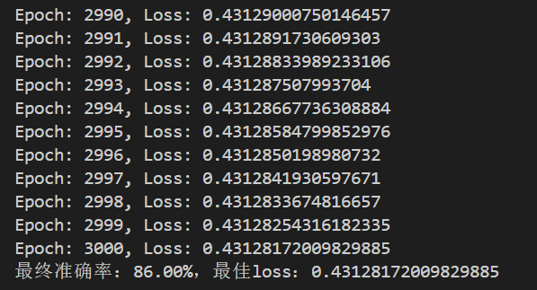
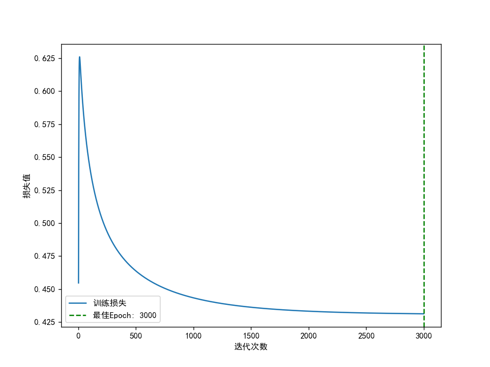
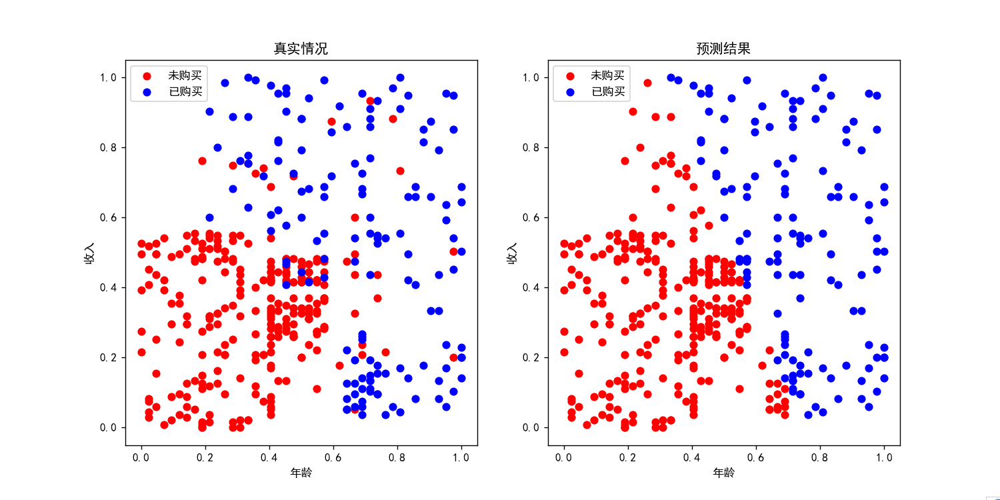
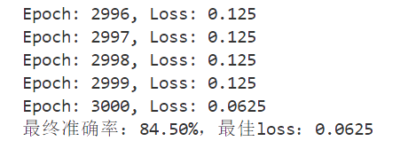
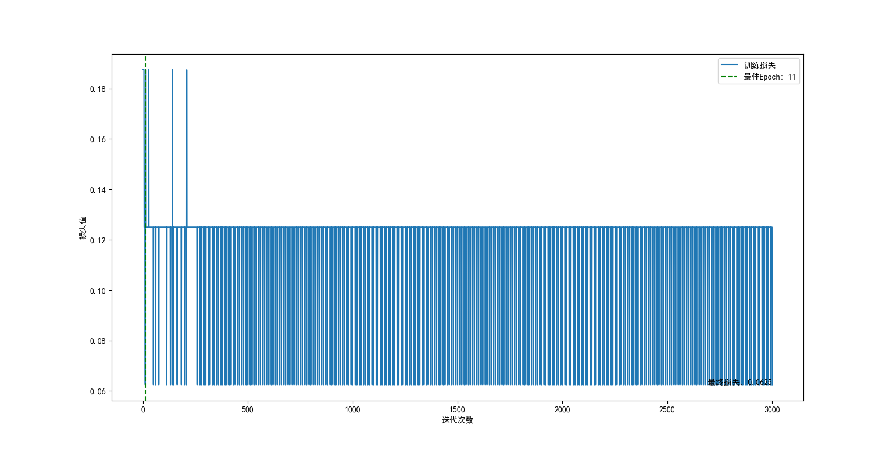
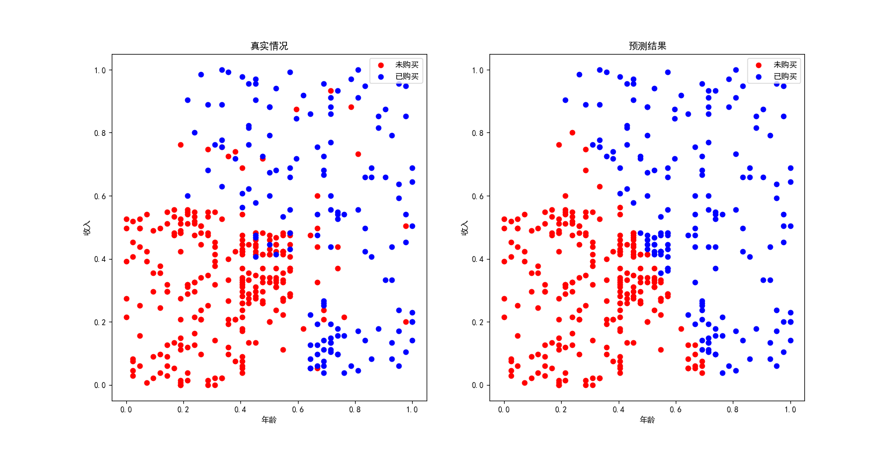

# 人工智能实验报告 实验作业7

<center>姓名:胡瑞康 学号:22336087</center>

## 实验题目

### 购房预测分类任务

`data.csv`数据集包含三列共400条数据，其中第一列`Age`表示用户年龄，第二列`EstimatedSalary`表示用户估计的薪水，第三列`Purchased`表示用户是否购房。请根据用户的年龄以及估计的薪水，利用逻辑回归算法和感知机算法预测用户是否购房，并画出数据可视化图、loss曲线图，计算模型收敛后的分类准确率。

### 提示

1. 最后提交的代码只需包含性能最好的实现方法和参数设置. 只需提交一个代码文件, 请不要提交其他文件.
2. 本次作业可以使用 `numpy`库、`matplotlib`库以及python标准库.
3. 数据集可以在Github上下载，或者如下所示。

## 实验内容

### 算法原理

#### 逻辑回归（Logistic Regression）

- 使用Sigmoid函数作为激活函数，将输入的年龄和估计薪水映射为购房的概率。
- 损失函数采用交叉熵损失，用于衡量模型预测的概率与实际购房标签之间的差距。
- 通过梯度下降法调整模型参数，使得损失最小化。

相关数学公式：
- **Sigmoid函数**：$ \sigma(z) = \frac{1}{1 + e^{-z}} $
- **预测值**：$ \hat{y} = \sigma(\mathbf{w} \cdot \mathbf{x} + b) $
- **交叉熵损失**：$ L(y, \hat{y}) = -\frac{1}{m} \sum_{i=1}^{m} \left[ y^{(i)} \log(\hat{y}^{(i)}) + (1 - y^{(i)}) \log(1 - \hat{y}^{(i)}) \right] $
- **梯度下降更新公式**：
   - $ \mathbf{w} = \mathbf{w} - \alpha \frac{\partial L}{\partial \mathbf{w}} $
   - $ b = b - \alpha \frac{\partial L}{\partial b} $
   - 其中，$ \frac{\partial L}{\partial \mathbf{w}} = \frac{1}{m} \sum_{i=1}^{m} (\hat{y}^{(i)} - y^{(i)}) \mathbf{x}^{(i)} $
   - $ \frac{\partial L}{\partial b} = \frac{1}{m} \sum_{i=1}^{m} (\hat{y}^{(i)} - y^{(i)}) $

#### 感知机（Perceptron）

- 使用阶跃函数（Step Function）作为激活函数，将输入的年龄和估计薪水映射为购房的预测结果。
- 损失函数采用误分类数，用于衡量模型预测结果与实际购房标签之间的差距。
- 通过误分类驱动调整模型参数，使得误分类数最小化。

相关数学公式：
- **阶跃函数**：$ \phi(z) = \begin{cases} 
   1 & \text{if } z > 0 \\
   0 & \text{if } z \leq 0 
\end{cases} $
- **预测值**：$ \hat{y} = \phi(\mathbf{w} \cdot \mathbf{x} + b) $
- **损失函数**：$ L(y, \hat{y}) = \sum_{i=1}^{m} \mathbb{I}(\hat{y}^{(i)} \neq y^{(i)}) $
- **参数更新规则**：
   - 当 $ y^{(i)} \neq \hat{y}^{(i)} $ 时：
      - $ \mathbf{w} = \mathbf{w} + \alpha (y^{(i)} - \hat{y}^{(i)}) \mathbf{x}^{(i)} $
      - $ b = b + \alpha (y^{(i)} - \hat{y}^{(i)}) $


### 代码展示

#### 逻辑回归：

核心代码如下

```python
class LogisticRegression:
    def __init__(self, input_dim, lr=0.1):
        np.random.seed(0)
        self.weights = np.random.randn(input_dim, 1) * np.sqrt(2. / input_dim)
        self.bias = np.zeros((1, 1))
        self.lr = lr

    # Sigmoid激活函数
    def sigmoid(self, z):
        return 1 / (1 + np.exp(-z))

    # 前向传播过程
    def forward(self, x):
        z = np.dot(x, self.weights) + self.bias
        return self.sigmoid(z)

    # 计算损失
    def loss(self, y_pred, y):
        m = y.shape[0]
        return -np.mean(y * np.log(y_pred) + (1 - y) * np.log(1 - y_pred))

    # 反向传播，更新参数
    def backprop(self, x, y):
        m = x.shape[0]
        y_pred = self.forward(x)
        dz = y_pred - y
        d_weights = np.dot(x.T, dz) / m
        d_bias = np.sum(dz) / m
        # 更新参数
        self.weights -= self.lr * d_weights
        self.bias -= self.lr * d_bias
```

该代码实现了一个用于购房预测任务的逻辑回归模型。逻辑回归是一种广泛使用的分类算法，可以通过学习数据特征来预测二元结果。在本例中，模型的目标是预测某人是否会购买房产。

1. **初始化函数 `__init__`**：
   - `input_dim`：输入特征的维度，即特征数目。
   - `lr`：学习率，用于控制参数更新的步长。
   - `self.weights`：随机初始化权重，形状为 `(input_dim, 1)`，标准差调整为 `sqrt(2.0 / input_dim)` 以确保初始模型在不同输入特征数下有相似的初始状态。
   - `self.bias`：初始化偏差为 0，形状为 `(1, 1)`。
   - `self.lr`：存储学习率。

2. **`sigmoid`函数**：
   - 这是一个激活函数，用于将线性组合的结果（z）映射到 `[0, 1]` 范围内的概率值，公式为：`sigmoid(z) = 1 / (1 + exp(-z))`。

3. **`forward`函数**：
   - 输入为特征数据 `x`。
   - `z`：计算线性组合结果 `z = np.dot(x, self.weights) + self.bias`。
   - 使用 `sigmoid` 函数将 `z` 转换为预测的概率值。

4. **`loss`函数**：
   - 计算交叉熵损失，用于衡量预测概率与实际标签之间的差距。
   - `m`：样本数量。
   - 损失公式为：`loss = -mean(y * log(y_pred) + (1 - y) * log(1 - y_pred))`。

5. **`backprop`函数**：
   - 用于反向传播计算和更新模型参数。
   - `m`：样本数量。
   - 首先使用 `forward` 函数计算预测值 `y_pred`。
   - 计算损失的梯度：`dz = y_pred - y`。
   - 计算权重的梯度：`d_weights = np.dot(x.T, dz) / m`。
   - 计算偏差的梯度：`d_bias = np.sum(dz) / m`。
   - 使用学习率 `self.lr` 更新模型参数 `weights` 和 `bias`。


#### 感知机

核心代码如下
```python
# 感知机模型类
class Perceptron:
    def __init__(self, input_dim, lr=0.1):
        np.random.seed(0)
        self.weights = np.random.randn(input_dim, 1) * np.sqrt(2. / input_dim)
        self.bias = np.zeros((1, 1))
        self.lr = lr

    # 激活函数
    def step_function(self, z):
        return np.where(z > 0, 1, 0)

    # 前向传播过程
    def forward(self, x):
        z = np.dot(x, self.weights) + self.bias
        return self.step_function(z)

    # 计算损失
    def loss(self, y_pred, y):
        return np.mean(y_pred != y)

    # 更新参数
    def update_weights(self, x, y):
        y_pred = self.forward(x)
        error = y - y_pred
        self.weights += self.lr * np.dot(x.T, error)
        self.bias += self.lr * np.sum(error, axis=0)
```

该代码实现了一个用于购房预测任务的感知机模型。感知机是一种基本的线性分类算法，可以通过学习数据特征来预测二元结果。在本例中，模型的目标是预测某人是否会购买房产。

1. **初始化函数 `__init__`**：
   - `input_dim`：输入特征的维度，即特征数目。
   - `lr`：学习率，用于控制参数更新的步长。
   - `self.weights`：随机初始化权重，形状为 `(input_dim, 1)`，标准差调整为 `sqrt(2.0 / input_dim)` 以确保初始模型在不同输入特征数下有相似的初始状态。
   - `self.bias`：初始化偏差为 0，形状为 `(1, 1)`。
   - `self.lr`：存储学习率。

2. **`step_function`函数**：
   - 这是一个激活函数，用于将线性组合的结果（z）映射为离散的二元值（0或1），公式为：`step_function(z) = np.where(z > 0, 1, 0)`。

3. **`forward`函数**：
   - 输入为特征数据 `x`。
   - `z`：计算线性组合结果 `z = np.dot(x, self.weights) + self.bias`。
   - 使用 `step_function` 函数将 `z` 转换为预测的分类值（0或1）。

4. **`loss`函数**：
   - 计算误分类数，用于衡量预测结果与实际标签之间的差距。
   - 损失公式为：`loss = np.mean(y_pred != y)`。

5. **`update_weights`函数**：
   - 用于参数更新，基于误分类的样本调整模型参数。
   - `y_pred`：通过 `forward` 函数计算预测值。
   - `error`：计算预测值与实际标签之间的误差，公式为：`error = y - y_pred`。
   - 计算权重更新：`self.weights += self.lr * np.dot(x.T, error)`。
   - 计算偏差更新：`self.bias += self.lr * np.sum(error, axis=0)`。


## 实验结果及分析

### 实验结果展示示例

#### 逻辑回归：

从实验结果中可以看到逻辑回归模型的训练过程和最终预测情况：

1. **控制台结果**：最终准确率：86.00%，最佳loss：0.43128172009829885

   

2. **损失曲线图**：模型损失随着迭代次数的增加逐渐下降，在第3000次迭代时达到最佳状态，损失值趋于稳定。这表明模型在逐渐学习到数据的模式，并收敛到相对较低的损失。

   

3. **预测结果图**：该图显示了逻辑回归模型的预测结果。红色表示模型预测用户未购买房产，蓝色表示模型预测用户已购买房产。模型能够很好地将两类分开，但仍有一些数据点未能准确分类。

   


#### 感知机：


1. **控制台结果**：最终准确率：84.50%，最佳loss：0.0625
   

2. **损失曲线图**：损失曲线可以看到，由于该样本并不完全线性可分，所以在较低loss震荡
   

3. **预测结果图**：预测结果图显示了模型在测试集上的表现。左图表示真实情况，右图表示预测结果。红色点表示未购买房产，蓝色点表示已购买房产。可以看到，感知机模型能够较好地区分两类数据，但由于不是线性可分导致也存在一些误分类。
   
