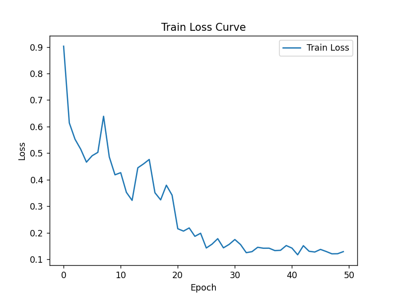
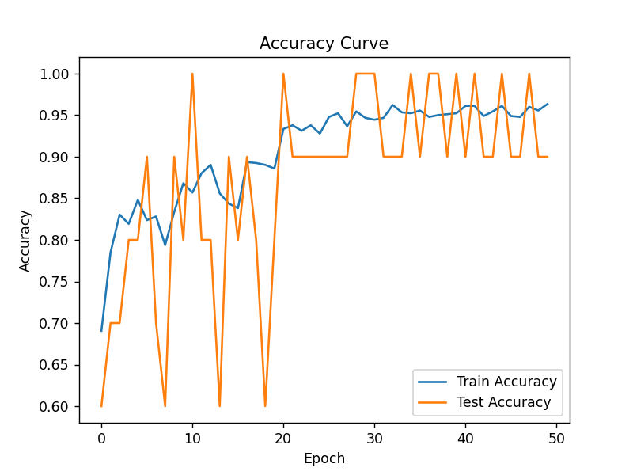

# 人工智能实验报告 实验作业9

<center>姓名:胡瑞康 学号:22336087</center>

## 一.实验题目

### 中药图片分类任务

利用pytorch框架搭建神经网络实现中药图片分类，其中中药图片数据分为训练集`train`和测试集`test`，训练集仅用于网络训练阶段，测试集仅用于模型的性能测试阶段。训练集和测试集均包含五种不同类型的中药图片：`baihe`、`dangshen`、`gouqi`、`huaihua`、`jinyinhua`。请合理设计神经网络架构，利用训练集完成网络训练，统计网络模型的训练准确率和测试准确率，画出模型的训练过程的loss曲线、准确率曲线。

### 提示

1. 最后提交的代码只需包含性能最好的实现方法和参数设置. 只需提交一个代码文件, 请不要提交其他文件.
2. 本次作业可以使用 `pytorch`相关的库、`numpy`库、`matplotlib`库以及python标准库.
3. 数据集可以在Github上下载。
4. 模型的训练性能以及测试性能均作为本次作业的评分标准。
5. 测试集不可用于模型训练。
## 二.实验内容

### 1. 算法原理

本实验利用深度学习中的卷积神经网络（CNN）来实现中药图片的分类任务。我采用了预训练的ResNet18模型，进行迁移学习，以减少训练时间和计算资源需求。ResNet18模型通过残差连接解决了深层神经网络训练中的梯度消失问题，使得网络能够更好地捕捉图像中的特征。

具体步骤如下：
1. 数据预处理：对图片进行随机裁剪、水平翻转以及标准化，以增加数据的多样性，防止过拟合。
2. 模型设计：使用预训练的ResNet18模型，并将最后一层全连接层修改为5个输出节点，以适应五种中药分类任务。
3. 模型训练：采用交叉熵损失函数和随机梯度下降优化器进行训练，并使用学习率调度器进行学习率调整。
4. 模型评估：在测试集上评估模型的性能，并保存性能最好的模型参数。

### 2. 创新点&优化

1. **迁移学习**：利用预训练模型ResNet18，减少了训练时间，并提高了模型的准确性。
2. **数据增强**：通过随机裁剪、水平翻转等数据增强技术，提高了模型的泛化能力，防止过拟合。
3. **学习率调度器**：使用学习率调度器，动态调整学习率，提升模型训练的稳定性和收敛速度。
4. **模型性能保存**：每次在测试集上评估模型性能，并保存表现最好的模型参数，确保最终提交的模型达到最佳效果。


### 3. 代码展示

#### `TestDataset` 类

`TestDataset` 是一个自定义的 Dataset 类，用于加载测试数据。它遍历指定目录下的所有文件，根据文件名判断其类别，并将其添加到图像和标签列表中。图像会转换为 RGB 格式，并应用预定义的图像变换。

```python
import os
import torch
import torchvision.transforms as transforms
from torchvision.datasets import ImageFolder
from torch.utils.data import DataLoader, Dataset
from torchvision import models
import torch.nn as nn
import torch.optim as optim
import matplotlib.pyplot as plt
from PIL import Image

# 自定义Dataset类用于加载测试集
class TestDataset(Dataset):
    def __init__(self, root, transform=None):
        self.root = root
        self.transform = transform
        self.images = []
        self.labels = []
        self.classes = ['baihe', 'dangshen', 'gouqi', 'huaihua', 'jinyinhua']
        self.class_to_idx = {cls: idx for idx, cls in enumerate(self.classes)}
        for filename in os.listdir(root):
            for cls in self.classes:
                if filename.startswith(cls):
                    self.images.append(os.path.join(root, filename))
                    self.labels.append(self.class_to_idx[cls])
                    break

    def __len__(self):
        return len(self.images)

    def __getitem__(self, idx):
        image_path = self.images[idx]
        image = Image.open(image_path).convert("RGB")
        if self.transform:
            image = self.transform(image)
        label = self.labels[idx]
        return image, label
```

#### 全局变量设置

设置模型文件的保存路径、训练集和测试集的目录路径，并定义数据预处理操作，包括随机裁剪、水平翻转和标准化处理。通过 `ImageFolder` 类加载训练集，并使用自定义的 `TestDataset` 类加载测试集。最后，定义数据加载器用于批量加载数据，并检查是否有可用的 GPU。

```python
model_path = os.path.dirname(os.path.abspath(__file__)).replace("\\", "/") + "/best_model.pth"
train_dir = os.path.join(os.path.dirname(os.path.abspath(__file__)), "./train").replace("\\", "/")
test_dir = os.path.join(os.path.dirname(os.path.abspath(__file__)), "./test").replace("\\", "/")

# 定义数据预处理
transform = transforms.Compose([
    transforms.RandomResizedCrop(224),
    transforms.RandomHorizontalFlip(),
    transforms.ColorJitter(brightness=0.4, contrast=0.4, saturation=0.4, hue=0.1),
    transforms.RandomRotation(20),
    transforms.ToTensor(),
    transforms.Normalize(mean=[0.485, 0.456, 0.406], std=[0.229, 0.224, 0.225])
])

# 加载训练集
train_dataset = ImageFolder(root=train_dir, transform=transform)
test_dataset = TestDataset(root=test_dir, transform=transform)

# 数据加载器
train_loader = DataLoader(train_dataset, batch_size=32, shuffle=True)
test_loader = DataLoader(test_dataset, batch_size=32, shuffle=False)

# 检查是否有可用的GPU
device = torch.device("cuda" if torch.cuda.is_available() else "cpu")
```

#### 核心函数 `main`

`main` 函数是程序的核心部分，包含以下步骤：
1. 加载预训练的 ResNet18 模型，并修改最后一层为 5 个输出节点，添加 Dropout 层。
2. 定义损失函数和优化器，使用 Adam 优化器和交叉熵损失函数。
3. 训练模型，包括前向传播、计算损失、反向传播和参数更新。
4. 记录每个 epoch 的训练损失和准确率，并在测试集上评估模型性能。
5. 使用学习率调度器动态调整学习率。
6. 保存性能最好的模型参数。
7. 绘制训练损失曲线和准确率曲线。

```python
def main():
    weights = models.ResNet18_Weights.IMAGENET1K_V1
    model = models.resnet18(weights=weights)
    num_ftrs = model.fc.in_features

    # 添加 Dropout 层
    model.fc = nn.Sequential(
        nn.Dropout(0.5),
        nn.Linear(num_ftrs, 5)
    )
    model = model.to(device)

    # 定义损失函数和优化器
    criterion = nn.CrossEntropyLoss()
    optimizer = optim.Adam(model.parameters(), lr=0.001)
    scheduler = optim.lr_scheduler.ReduceLROnPlateau(optimizer, mode='min', factor=0.1, patience=5)

    num_epochs = 50
    best_acc = 0.0
    train_acc_history = []
    test_acc_history = []
    train_loss_history = []

    for epoch in range(num_epochs):
        model.train()
        running_loss = 0.0
        correct = 0
        total = 0

        for inputs, labels in train_loader:
            inputs, labels = inputs.to(device), labels.to(device)
            optimizer.zero_grad()

            outputs = model(inputs)
            loss = criterion(outputs, labels)
            loss.backward()
            optimizer.step()

            running_loss += loss.item() * inputs.size(0)
            _, predicted = torch.max(outputs, 1)
            total += labels.size(0)
            correct += (predicted == labels).sum().item()

        epoch_loss = running_loss / len(train_loader.dataset)
        epoch_acc = correct / total

        train_loss_history.append(epoch_loss)
        train_acc_history.append(epoch_acc)

        print(f'Epoch {epoch+1}/{num_epochs}, Loss: {epoch_loss:.4f}, Train Accuracy: {epoch_acc:.4f}')

        # 更新学习率
        scheduler.step(epoch_loss)

        # 测试模型
        model.eval()
        correct = 0
        total = 0
        with torch.no_grad():
            for inputs, labels in test_loader:
                inputs, labels = inputs.to(device), labels.to(device)
                outputs = model(inputs)
                _, predicted = torch.max(outputs, 1)
                total += labels.size(0)
                correct += (predicted == labels).sum().item()

        test_acc = correct / total
        test_acc_history.append(test_acc)
        print(f'Test Accuracy: {test_acc:.4f}')

        # 保存性能最好的模型
        if test_acc > best_acc:
            best_acc = test_acc
            torch.save(model.state_dict(), model_path)

    # 调用绘图函数
    plot_accuracy_curve(train_loss_history, train_acc_history, test_acc_history)
```

#### 测试函数 `load_and_test_model`

`load_and_test_model` 函数用于加载保存的最佳模型，并在测试集上评估其性能。该函数会打印模型在测试集上的准确率。

```python
def load_and_test_model():
    global model_path, test_loader, device
    model = models.resnet18(weights=models.ResNet18_Weights.IMAGENET1K_V1)
    num_ftrs = model.fc.in_features
    model.fc = nn.Linear(num_ftrs, 5)
    model.load_state_dict(torch.load(model_path))
    model = model.to(device)
    model.eval()

    correct = 0
    total = 0

    with torch.no_grad():
        for inputs, labels in test_loader:
            inputs, labels = inputs.to(device), labels.to(device)
            outputs = model(inputs)
            _, predicted = torch.max(outputs, 1)
            total += labels.size(0)
            correct += (predicted == labels).sum().item()

    test_acc = correct / total
    print(f'Loaded model Test Accuracy: {test_acc:.4f}')
    return test_acc
```

#### 绘图函数 `plot_accuracy_curve`

`plot_accuracy_curve` 函数用于绘制训练过程中的损失曲线和准确率曲线。该函数接收训练损失历史、训练准确率历史和测试准确率历史作为输入，并生成相应的图表。

```python
def plot_accuracy_curve(train_loss_history, train_acc_history, test_acc_history):
    plt.figure()
    plt.plot(train_loss_history, label='Train Loss')
    plt.xlabel('Epoch')
    plt.ylabel('Loss')
    plt.title('Train Loss Curve')
    plt.legend()
    plt.show()

    plt.figure()
    plt.plot(train_acc_history, label='Train Accuracy')
    plt.plot(test_acc_history, label='Test Accuracy')
    plt.xlabel('Epoch')
    plt.ylabel('Accuracy')
    plt.title('Accuracy Curve')
    plt.legend()
    plt.show()
```
## 三.实验结果及分析

### 1.实验结果展示示例

准确率
```shell
Epoch 1/50, Loss: 0.9031, Train Accuracy: 0.6907
Test Accuracy: 0.6000
Epoch 2/50, Loss: 0.6138, Train Accuracy: 0.7849
Test Accuracy: 0.7000
Epoch 3/50, Loss: 0.5524, Train Accuracy: 0.8304
Test Accuracy: 0.7000
Epoch 4/50, Loss: 0.5146, Train Accuracy: 0.8193
Test Accuracy: 0.8000
Epoch 5/50, Loss: 0.4660, Train Accuracy: 0.8481
Test Accuracy: 0.8000
Epoch 6/50, Loss: 0.4902, Train Accuracy: 0.8237
Test Accuracy: 0.9000
Epoch 7/50, Loss: 0.5029, Train Accuracy: 0.8282
Test Accuracy: 0.7000
Epoch 8/50, Loss: 0.6389, Train Accuracy: 0.7938
Test Accuracy: 0.6000
Epoch 9/50, Loss: 0.4858, Train Accuracy: 0.8337
Test Accuracy: 0.9000
...
Epoch 40/50, Loss: 0.1516, Train Accuracy: 0.9523
Test Accuracy: 1.0000
Epoch 41/50, Loss: 0.1421, Train Accuracy: 0.9612
Test Accuracy: 0.9000
Epoch 42/50, Loss: 0.1168, Train Accuracy: 0.9612
Test Accuracy: 1.0000
Epoch 43/50, Loss: 0.1512, Train Accuracy: 0.9490
Test Accuracy: 0.9000
Epoch 44/50, Loss: 0.1301, Train Accuracy: 0.9545
Test Accuracy: 0.9000
Epoch 45/50, Loss: 0.1273, Train Accuracy: 0.9612
Test Accuracy: 1.0000
Epoch 46/50, Loss: 0.1371, Train Accuracy: 0.9490
Test Accuracy: 0.9000
Epoch 47/50, Loss: 0.1292, Train Accuracy: 0.9479
Test Accuracy: 0.9000
Epoch 48/50, Loss: 0.1205, Train Accuracy: 0.9601
Test Accuracy: 1.0000
Epoch 49/50, Loss: 0.1208, Train Accuracy: 0.9557
Test Accuracy: 0.9000
Epoch 50/50, Loss: 0.1287, Train Accuracy: 0.9634
Test Accuracy: 0.9000
```

下图显示了模型在训练过程中的损失变化曲线。可以看到，随着训练轮次的增加，损失逐渐减小，并在训练结束时趋于稳定。



下图展示了训练集和测试集在整个训练过程中的准确率变化曲线。可以看到，训练准确率和测试准确率均表现良好，最终达到了较高的准确度。



通过以上实验结果可以看出，模型在训练集和测试集上的准确率均有较好的表现。通过数据增强和学习率调度等优化方法，有效提升了模型的泛化能力和训练效果。