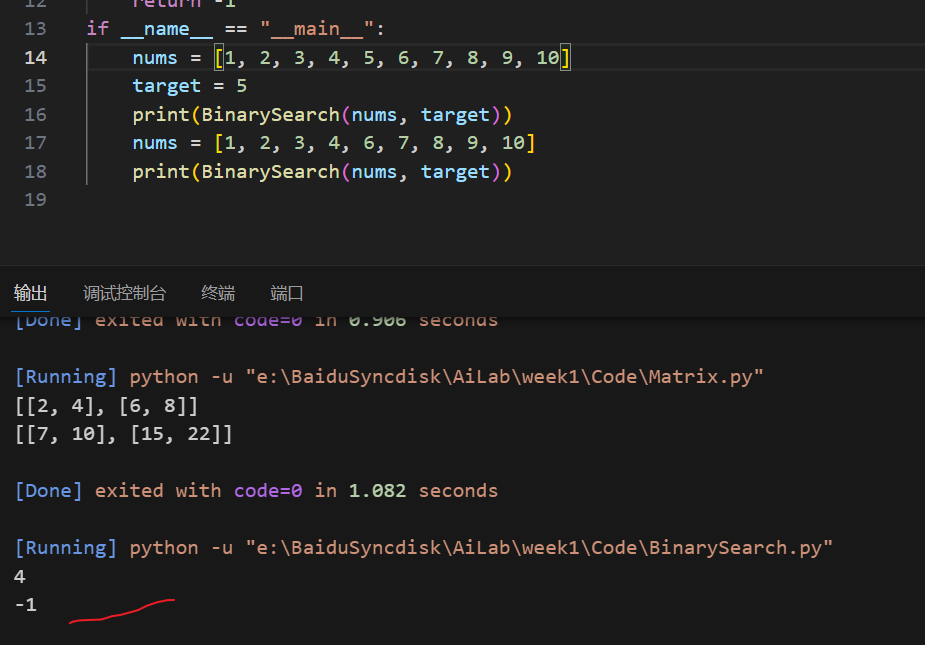
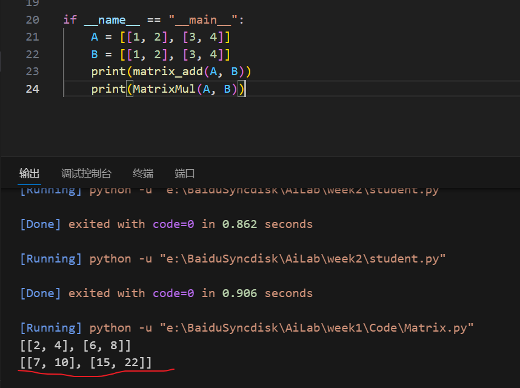
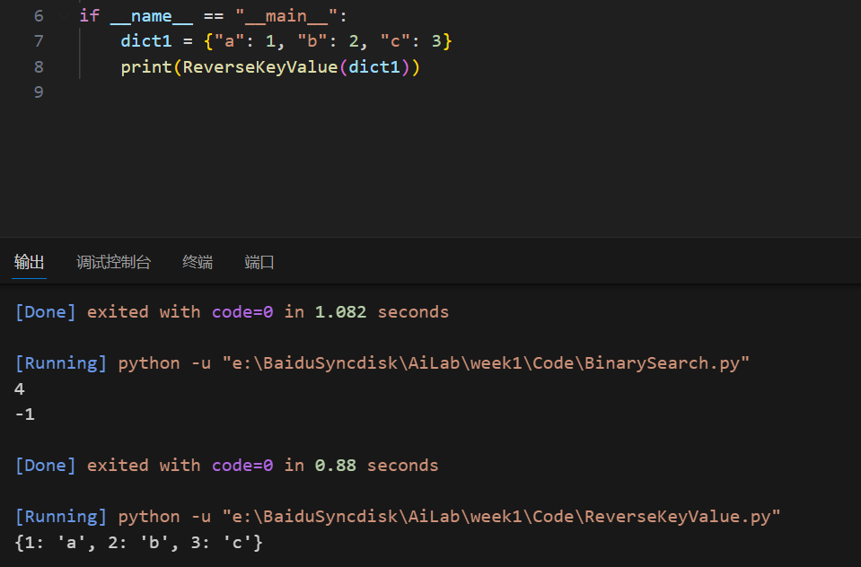

# 人工智能实验报告 第1周

姓名:胡瑞康  学号:22336087

## 一.实验题目

二分查找；矩阵加法,乘法；字典遍历

## 二.实验内容

### 1.算法原理

**二分查找**

1.首先，将目标元素与数组中间元素进行比较。

2.如果目标元素等于中间元素，则找到了目标，算法结束。如果目标元素小于中间元素，则在数组的左半部分（较小的一半）继续搜索目标元素。如果目标元素大于中间元素，则在数组的右半部分（较大的一半）继续搜索目标元素。

3.重复上述步骤，直到找到目标元素或者确定目标元素不在数组中。

这种算法的关键在于每次比较都使搜索范围减半，因此它的时间复杂度为O(log n)

**矩阵相加**

通过两层嵌套的循环，遍历矩阵 A 和 B 中的每个元素，并将对应位置的元素相加，然后将结果存入新的矩阵 C 的对应位置。

**矩阵相乘**

通过三层嵌套的循环，遍历矩阵 A 和 B 中的每个元素，计算对应位置的乘积累加到新的矩阵 C 中。

具体来说，通过第三层循环遍历矩阵 A 的行和矩阵 B 的列，将对应位置的元素相乘并累加到结果矩阵 C 的对应位置。

**字典遍历**

读取字典的key与value，新建的时候交换位置即可

## 三.实验结果及分析

### 1.实验结果展示示例

能够正确查到元素`5`的下标，不存在则返回-1

能够正确计算矩阵的加法与乘法

成功将字典的键名和键值反向

