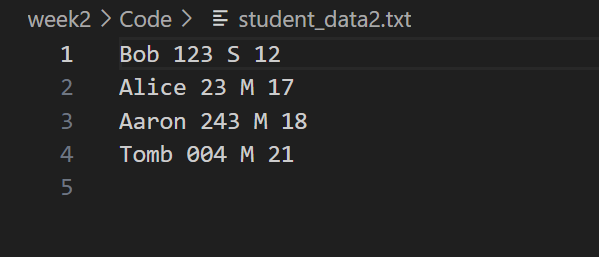

# 人工智能实验报告 第2周

姓名:胡瑞康  学号:22336087

## 一.实验题目

管理Student数据

## 二.实验内容

本实验通过编写一个StuData类，实现对学生数据的管理，包括从文件读取数据、添加数据、排序数据以及导出数据到文件等功能。

### 1.算法原理

- `__init__(self, file:str)`: 初始化方法，从指定文件中读取学生数据，如果文件不存在则初始化为空列表。
- `AddData(self, name="Bob", stu_num="003", gender="M", age=20)`: 添加新的学生数据到列表，默认值为Bob, 003, M, 20。
- `SortData(self, type:str)`: 根据指定类型对学生数据进行排序，支持按姓名、学号、性别和年龄排序。对于年龄，先用`int()`函数将字符串转换为整数，然后按照从小到大的顺序进行排序。
- `ExportFile(self, file: str)`: 将学生数据导出到指定文件中。
- `PrintData(self)`: 打印当前的学生数据用于调试

## 三.实验结果及分析

### 1.实验结果展示示例

#### 初始数据：

[['Alice', '001', 'F', 18], ['Bob', '002', 'M', 19], ['Carol', '003', 'F', 20]]

#### 添加数据后：

[['Alice', '001', 'F', 18], ['Bob', '002', 'M', 19], ['Carol', '003', 'F', 20], ['Tomb', '004', 'M', 21]]

#### 按年龄排序后：

[['Alice', '001', 'F', 18], ['Bob', '002', 'M', 19], ['Carol', '003', 'F', 20], ['Tomb', '004', 'M', 21]]

在这个示例中，我们首先展示了初始的学生数据，然后添加了一个新的学生数据'Tomb', '004', 'M', 21，最后按照年龄对学生数据进行了排序。

成功导出到文件

