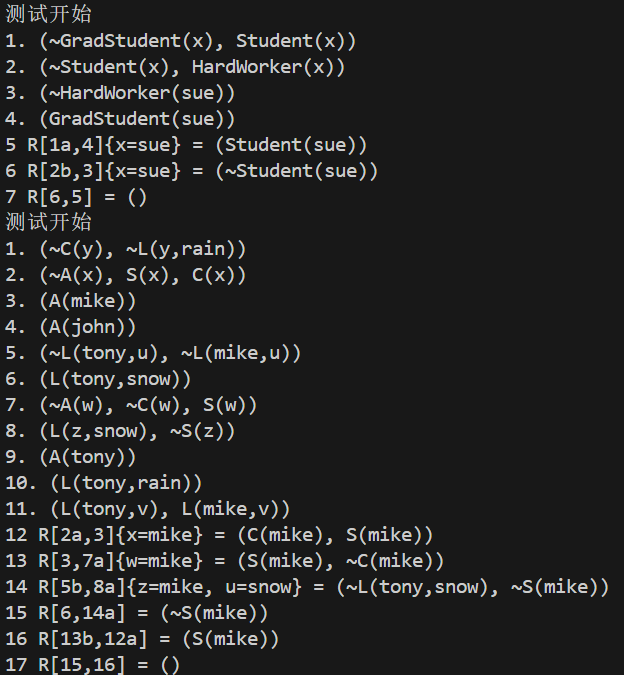
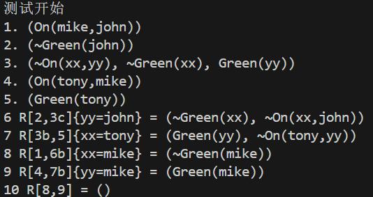

# 人工智能实验报告 第 4 周

姓名:胡瑞康 学号:22336087

## 一.实验题目

编写函数 `ResolutionFOL`实现一阶逻辑的归结推理

## 二.实验内容

### 1.算法原理

#### 算法介绍

1. **子句表示与解析**：每个子句是一组一阶逻辑公式的集合，其中的公式不含存在量词（$\exists$）和全称量词（$\forall$）。这些子句用于表示知识库（KB）。

2. **最一般合一（MGU）**：最一般合一是找到一个替换集合，使得应用这个替换后，两个字面量（逻辑表达式）看起来相同。这一过程是归结推理中解决变量绑定的核心步骤。

3. **归结规则**：归结规则允许从两个子句中产生一个新的子句。具体来说，如果两个子句中有相互对立的字面量（即，一个子句中的某个字面量是另一个子句中某字面量的否定），且这对字面量可以通过最一般合一得到一致，则这两个子句可以归结。归结后得到的新子句包含了原两个子句中除了相互对立的字面量外的所有字面量，这些字面量应用了最一般合一得到的替换。

4. **推理过程**：从知识库（KB）的初始子句集开始，应用归结规则不断尝试合并子句，直到达到以下任一条件停止：
   - 生成了空子句，表示初始子句集内部存在逻辑矛盾。
   - 无法通过归结生成新的子句，表示无法从当前的知识库中推导出更多的结论。

#### 算法实现步骤

1. **初始化**：记录知识库中的所有子句，并为每个子句分配一个唯一标识。

2. **归结迭代**：遍历所有子句对，尝试应用归结规则。对于每一对子句：
   - 解析子句中的每个字面量，检查是否存在可以进行最一般合一的相对立的字面量对。
   - 应用最一般合一，生成新的子句（新子句中不包含被合一的相对立字面量）。
   - 记录每一步归结操作及其结果，包括使用的子句编号、最一般合一的替换集合以及归结后得到的新子句。

3. **终止条件**：重复上述过程，直到生成空子句或无法进一步通过归结产生新的子句。生成空子句表示原子句集不一致。

### 2.创新点&优化(如果有)

为了减少推理路径，可以通过记录每个新子句是由哪两个子句归结得到的信息来实现。这样，一旦找到空子句，就可以从这个空子句开始反向追踪，直到回到原始的知识库（KB）中的子句，构建出一条最短的推理路径.

具体通过以下步骤实现：

- 初始化：将所有的推理步骤存储在一个字典中，其中键为步骤编号，值为步骤字符串。

- 反向追踪：从最后一个推理步骤开始，逐步向前追踪。每个推理步骤都依赖于前面的一些步骤。通过解析每个步骤字符串，找出它依赖的步骤编号，并将这些步骤加入到追踪队列中。

- 构建最短链：通过反向追踪的过程，我们可以确定哪些步骤是构成最后结论的必要步骤。只保留这些必要步骤，并按照原始顺序重新排列，就可以得到最短的推理链。

- 返回结果：最终返回一个包含最短推理链步骤的列表。

### 3.代码展示
```python
import re

# 最一般合一算法
def MGU(f1, f2):
    # 获取谓词的参数列表
    def get_param(f):
        # 去除可能的否定标记以便提取参数
        if f.startswith('~'):
            f = f[1:]
        match = re.match(r'(\w+)\((.*)\)', f)
        if match:
            terms = match.group(2).split(',')
            return terms
        return []

    # 判断是否是单个变量
    def is_variable(term):
        return re.match(r'^[u-z]{1,2}$', term) is not None

    # 在term中替换所有出现的var为value
    def substitute(var, value, term):
        # 确保仅替换整个单词，避免部分替换
        return re.sub(r'\b' + var + r'\b', value, term)

    p1 = get_param(f1)
    p2 = get_param(f2)
    res = {}
    queue = list(zip(p1, p2))

    while queue:
        e1, e2 = queue.pop(0)
        check1 = is_variable(e1)
        check2 = is_variable(e2)
        if e1 == e2:
            continue
        elif check1 and check2:
            continue
        elif check1:
            if e1 in e2:
                return {}  # 变量循环，合一失败
            else:
                res[e1] = e2
                # 替换队列中剩余的项
                queue = [(substitute(e1, e2, x), y) for x, y in queue]
        elif check2:
            if e2 in e1:
                return {}  # 变量循环，合一失败
            else:
                res[e2] = e1
                # 替换队列中剩余的项
                queue = [(x, substitute(e2, e1, y)) for x, y in queue]
        else:
            match1 = re.match(r'(\w+)\((.*)\)', e1)
            match2 = re.match(r'(\w+)\((.*)\)', e2)
            if match1 and match2 and match1.group(1) == match2.group(1):
                subterms1 = match1.group(2).split(',')
                subterms2 = match2.group(2).split(',')
                queue.extend(zip(subterms1, subterms2))
            else:
                return {}  # 谓词不匹配或不是复合项，合一失败
    return res

# 一阶逻辑的归结推理
def ResolutionFOL(KB):
    # 将子句格式化为字符串
    def format_clause(clause):
        if len(clause) == 0:
            return "()"
        else:
            return "(" + ", ".join(clause) + ")"

    # 对字面量进行否定
    def negate(literal):
        if literal.startswith("~"):
            return literal[1:]
        else:
            return "~" + literal

    # 判断是否是单个变量
    def is_variable(term):
        return re.match(r'^[u-z]{1,2}$', term) is not None
    # 解析字面量
    def parse_literal(literal):
        match = re.match(r'(~?)(\w+)\((.*)\)', literal)
        if match:
            return {'neg': match.group(1) == '~', 'pred': match.group(2), 'terms': match.group(3).split(',')}
        return None

    # 对两个字面量进行最一般合一
    def unify_literals(li, lj):
        parsed_li = parse_literal(li)
        parsed_lj = parse_literal(lj)
        # 要求，谓词相同且符号不同
        if parsed_li['pred'] == parsed_lj['pred'] and parsed_li['neg']!=parsed_lj['neg']:
            res = MGU(li, lj)
            #如果res为{}，考虑可不可以消去
            if res != {}:
                return res
            # 说明无法替换变量解决，尝试是不是一模一样
            if len(parsed_li['terms']) == len(parsed_lj['terms']):
                # 判断所有都相同
                for i in range(len(parsed_li['terms'])):
                    if parsed_li['terms'][i]!=parsed_lj['terms'][i]:
                        return None
                return {"x":"x"}
            else:
                return None
        return None

    # 解析子句中的每个文字，记录其细节
    def parse_clause(clause):
        return [(i + 1, literal) for i, literal in enumerate(clause)]  # 返回形式为[(index, literal)]
    # 应用替换
    def apply_substitution(clause, substitution):
        new_clause = []
        for literal in clause:
            new_literal = literal
            for var, term in substitution.items():
                new_literal = new_literal.replace(var, term)
            new_clause.append(new_literal)
        return tuple(new_clause)
    # 生成归结步骤的描述字符串
    def generate_step_description(id, id_i, id_j, substitution, new_resolvent):
        # 过滤掉那些键和值相同的替换条目
        meaningful_substitution = {k: v for k, v in substitution.items() if k != v}

        # 检查是否有有意义的替换进行
        if meaningful_substitution:
            # 如果有有意义的替换，则添加替换信息
            substitution_str = ', '.join([f'{k}={v}' for k, v in meaningful_substitution.items()])
            return f"{id} R[{id_i},{id_j}]{{{substitution_str}}} = {format_clause(new_resolvent)}"
        else:
            # 如果没有有效的替换或者替换字典为空，则不添加替换信息
            return f"{id} R[{id_i},{id_j}] = {format_clause(new_resolvent)}"

    steps = []  # 存储推理步骤
    id = 1  # 步骤编号
    original_clauses = list(KB)  # 原始子句集
    clause_map = {}  # 子句到编号的映射
    new = set()  # 新产生的子句集

    # 记录初始子句
    for clause in original_clauses:
        clause_map[clause] = str(id)
        steps.append(f"{id}. {format_clause(clause)}")
        id += 1

    while True:
        n = len(original_clauses)
        found_empty_clause = False
        # 循环所有子句
        for i in range(n):
            for j in range(i + 1, n):
                if (i==j):
                    continue
                # 解析子句为文字list
                parsed_ci = parse_clause(original_clauses[i])
                parsed_cj = parse_clause(original_clauses[j])
                # 遍历文字
                for index_i, li in parsed_ci:
                    for index_j, lj in parsed_cj:
                        substitution = unify_literals(li, lj)
                        if substitution is not None:
                            # 删去互补的文字
                            new_resolvent = tuple(sorted(set(original_clauses[i] + original_clauses[j]) - {li, lj}))
                            # 替换变量
                            new_resolvent = apply_substitution(new_resolvent, substitution)
                            # if len(new_resolvent) == 2 and negate(new_resolvent[0]) == new_resolvent[1]:
                            #     new_resolvent = ()  # 将新解集设置为空子句表示矛盾
                            #     found_empty_clause = True  # 标记已找到矛盾
                            #     # 生成对应文字的编号
                            #     id_i = f"{clause_map[original_clauses[i]]}{chr(96 + index_i)}" if len(original_clauses[i]) > 1 else clause_map[original_clauses[i]]
                            #     id_j = f"{clause_map[original_clauses[j]]}{chr(96 + index_j)}" if len(original_clauses[j]) > 1 else clause_map[original_clauses[j]]
                            #     steps.append(generate_step_description(id, id_i, id_j, substitution, new_resolvent))
                            #     new.add(new_resolvent)
                            #     clause_map[new_resolvent] = str(id)
                            #     id += 1
                            #     break
                            # el
                            if new_resolvent not in original_clauses and new_resolvent not in new:
                                # 生成对应文字的编号
                                id_i = f"{clause_map[original_clauses[i]]}{chr(96 + index_i)}" if len(original_clauses[i]) > 1 else clause_map[original_clauses[i]]
                                id_j = f"{clause_map[original_clauses[j]]}{chr(96 + index_j)}" if len(original_clauses[j]) > 1 else clause_map[original_clauses[j]]
                                steps.append(generate_step_description(id, id_i, id_j, substitution, new_resolvent))
                                new.add(new_resolvent)
                                clause_map[new_resolvent] = str(id)
                                id += 1
                            if new_resolvent == ():
                                found_empty_clause = True
                                break
                    if found_empty_clause:
                        break
                if found_empty_clause:
                    break
            if found_empty_clause:
                break
        # 找到NIL，或者新的已经出现过，则结束
        if found_empty_clause or new.issubset(set(original_clauses)):
            # print(set(original_clauses))
            break
        original_clauses.extend(new)
        # 排序以便步骤更少
        original_clauses = sorted(original_clauses, key=lambda x: len(x))
        
    shortest_chain = find_shortest_chain(steps)
    updated_chain = update_step_numbers(shortest_chain)
    return updated_chain
# 反向追踪以找到最短的推理链
def find_shortest_chain(steps):
    # 所有的初始条件步骤（不包含'R'）自动认为是必要的
    necessary_steps = {int(re.match(r'^(\d+)', step).group(1)) for step in steps if 'R[' not in step}

    # 解析步骤，提取步骤编号和依赖的步骤编号
    def parse_step(step):
        match = re.search(r'^(\d+)\sR\[(\d+)([a-z]?),(\d+)([a-z]?)\]', step)
        if match:
            id = int(match.group(1))
            depends = [int(match.group(2)), int(match.group(4))]
            return id, depends
        return None, []

    # 构建步骤依赖图
    step_deps = {}
    for step in steps:
        id, deps = parse_step(step)
        if id:
            step_deps[id] = deps

    # 反向追踪
    queue = [max(step_deps.keys())] if step_deps else []
    while queue:
        current = queue.pop(0)
        if current in necessary_steps:
            continue
        necessary_steps.add(current)
        if current in step_deps:  # 如果当前步骤依赖其他步骤
            queue.extend(step_deps[current])  # 将依赖步骤加入追踪队列

    # 根据necessary_steps中的编号保留步骤
    shortest_chain = [step for step in steps if int(re.match(r'^(\d+)', step).group(1)) in necessary_steps]

    return shortest_chain


def update_step_numbers(shortest_chain):
    # 重编号前的准备：创建一个映射，将原始步骤编号映射到新编号
    original_to_new = {}
    updated_steps = []
    
    for i, step in enumerate(shortest_chain, 1):
        # 使用正则表达式匹配步骤字符串开始的数字序号
        match = re.match(r'^(\d+)', step)
        if match:
            original_id = int(match.group(1))
            original_to_new[original_id] = i  # 映射原始编号到新编号

    # 更新步骤字符串中的编号
    for step in shortest_chain:
        # 更新步骤自身编号
        match = re.match(r'^(\d+)', step)
        if match:
            original_id = int(match.group(1))
            step = step.replace(f"{original_id}", str(original_to_new[original_id]), 1)
        
        # 更新步骤内部R引用的编号
        def replace_func(match):
            # 提取并更新R引用中的编号
            id1 = int(match.group(1))
            id2 = int(match.group(3))
            new_id1 = original_to_new.get(id1, id1)
            new_id2 = original_to_new.get(id2, id2)
            # 返回更新后的R引用字符串
            return f"R[{new_id1}{match.group(2)},{new_id2}{match.group(4)}]"
        
        step = re.sub(r'R\[(\d+)([a-z]?),(\d+)([a-z]?)\]', replace_func, step)
        updated_steps.append(step)

    return updated_steps
def test(KB):
    print("测试开始")
    steps = ResolutionFOL(KB)
    for step in steps:
        print(step)
if __name__ == "__main__":
    if True:
        KB = {("GradStudent(sue)",),("~GradStudent(x)","Student(x)"),("~Student(x)","HardWorker(x)"),("~HardWorker(sue)",)}
        test(KB)
        KB = {("A(tony)",),("A(mike)",),("A(john)",),("L(tony,rain)",),("L(tony,snow)",),("~A(x)","S(x)","C(x)"),("~C(y)","~L(y,rain)"),("L(z,snow)","~S(z)"),("~L(tony,u)","~L(mike,u)"),("L(tony,v)","L(mike,v)"),("~A(w)","~C(w)","S(w)")}
        test(KB)

        KB = {("On(tony,mike)",),("On(mike,john)",),("Green(tony)",),("~Green(john)",),("~On(xx,yy)","~Green(xx)","Green(yy)")}
        test(KB)
    else:
        # 自己debug
        KB = {("L(tony,u)","L(mike,u)",),("~L(tony,u)","~L(mike,u)",)}
        test(KB)
```

## 三.实验结果及分析

### 1.实验结果展示示例

该算法能够根据输入，输出正确且较为短的推理步骤



