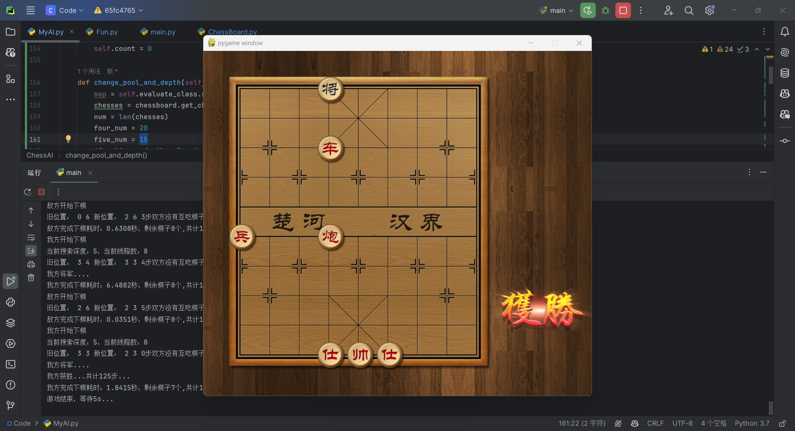
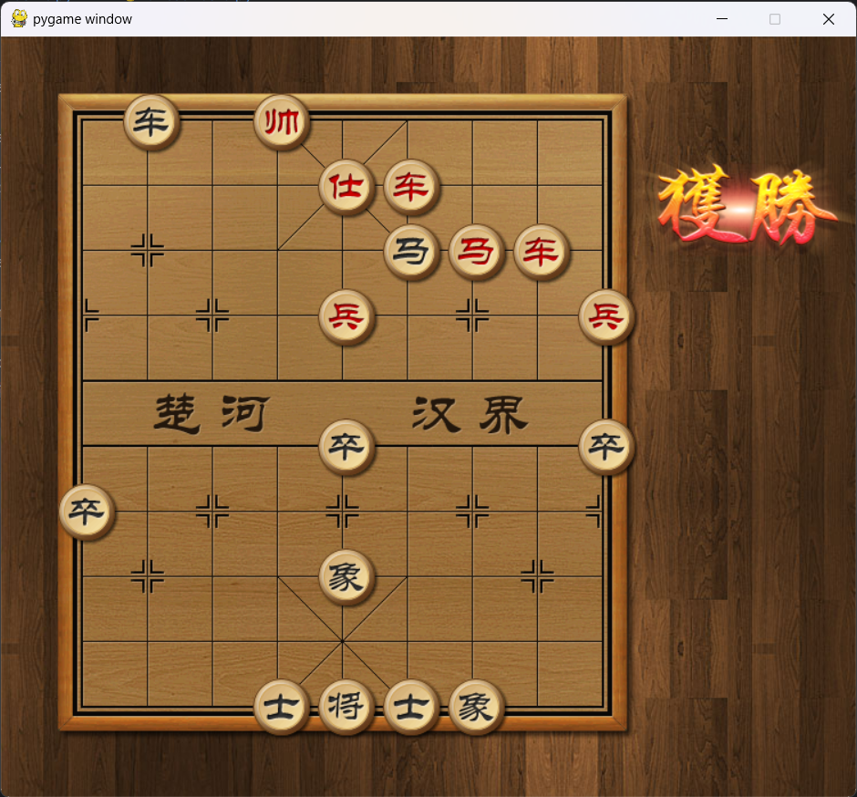

# 人工智能实验报告 实验作业4

姓名:胡瑞康 学号:22336087

## 一.实验题目

博弈树搜索中国象棋
### 文件介绍
- main.py 是main函数的程序，直接运行这个文件可以实现人机博弈对抗。
- 其他 .py 文件都是程序运行所需要的类，包括 ChessBoard 、 Game 等。
images 文件夹是可视化界面所需的图片。
- 对手AI在 ChessAI.py 中实现，对手AI类已被 pyarmor 加密，需要安装 pyarmor 库才能运行此py文
件。另外，我们提供了 linux 、 windows 、 mac 三个版本的加密文件，根据自己电脑的系统选择对应
版本的程序代码。
- MyAI.py 提供了 ChessAI.py 中部分代码逻辑，其中包括了 Evaluate 、 ChessMap 、
ChessAI 三个类。 Evaluate 类提供了当前象棋局面的奖励值，即每个棋子在棋盘上发任意位置都会有
一个奖励值，所有棋子的奖励值之和为整个棋面的奖励值。提供的奖励值仅仅作为参考，如果想要以更大的
概率打败对手AI，建议修改奖励值。 ChessAI 是实现算法的核心类，须在此类中实现搜索算法。
- 最终评估方法：与对手AI共博弈2次，其中先手、后手各评估一次（ 在main.py中未实现算法的红黑机指定
代码，需自行实现 ）。积分规则：胜一局记3分，平一局记1分，负一句记0分。
### 提示
重复走棋子：重复走子，判输
和棋：如果30个回合没有棋子被吃，判和

## 二.实验内容

### 1. 算法原理

本项目AI算法的核心基于**alpha-beta剪枝**和**多核优化**的搜索策略，以提高搜索效率并找到最优的走棋策略。

- **Alpha-Beta剪枝**：该算法是对极小化极大算法的优化，通过剪枝减少搜索树的节点，从而加快搜索速度。在搜索过程中，维护两个值，alpha代表当前路径上的最大值，beta代表当前路径上的最小值。如果在某个点发现继续搜索不会比已经找到的路径更优，则停止搜索该路径。
- **多核优化**：通过并行处理提高搜索速度。在搜索树的第一层并行计算，利用多核CPU的并行处理能力，加速整体的搜索过程。

### 2. 创新点&优化

- **多核优化**：利用Python的`multiprocessing`库，实现了搜索过程的并行计算，充分利用多核CPU资源，提高搜索效率。
- **迭代加深**：在搜索深度上进行了优化，随着游戏进行，剩余棋子数量减少，搜索深度逐步增加，使AI在游戏后期能够做出更加精确的判断。


### 3.代码展示
Fun.py

该文件主要包含辅助函数，用于中国象棋AI的核心逻辑处理，主要功能包括缓存棋盘的可能下点位、模拟下棋、回溯下棋等。通过这些辅助函数，AI能够高效地评估棋局状态，预测未来可能的走棋，以及在必要时回溯到先前的棋局状态。具体实现如下：

1. **缓存棋盘可能的下点位（`cache_chess_put`和`get_cache_chess_put`函数）**：
   - 这部分实现了对每个棋子可能的落子位置的缓存，以减少重复计算，提高AI算法的效率。通过将棋盘状态和棋子信息作为键，可能的落子位置作为值存储在`cache`字典中。

2. **模拟下棋（`make_move`函数）**：
   - 模拟在棋盘上移动棋子，记录棋子的旧位置，并在棋盘上执行移动。这是进行棋局搜索和评估时的基础操作，允许AI "思考"其走棋的后果而不影响实际棋局。

3. **回溯下棋（`undo_move`函数）**：
   - 用于撤销`make_move`函数所做的棋子移动，恢复棋局到移动前的状态。这是实现搜索算法如alpha-beta剪枝时的关键步骤，允许AI探索不同的走棋路径而不丢失棋局的原始状态。
```python
import os
from ChessBoard import ChessBoard
from Chess import Chess
import json

# 改进后的缓存结构
cache = {}
def cache_chess_put(chessboard: ChessBoard):
    global cache
    board_state_str = json.dumps(chessboard.get_chessboard_str_map())
    for chess in chessboard.get_chess():
        key = (board_state_str, chess.team, chess.name, chess.row, chess.col)
        cache[key] = chessboard.get_put_down_position(chess)
def get_cache_chess_put(chess: Chess, chessboard: ChessBoard):
    global cache
    board_state_str = json.dumps(chessboard.get_chessboard_str_map())
    key = (board_state_str, chess.team, chess.name, chess.row, chess.col)
    if key not in cache:
        cache[key] = chessboard.get_put_down_position(chess)
    if os.environ['debug'] == "True":
        print(cache[key])
    return cache[key]
def make_move(chessboard, chess, new_row, new_col):
    # 记录旧位置和棋子
    old_row, old_col = chess.row, chess.col
    taken_chess = chessboard.chessboard_map[new_row][new_col]
    # 执行移动
    chessboard.chessboard_map[old_row][old_col] = None
    chessboard.chessboard_map[new_row][new_col] = chess
    chess.update_position(new_row, new_col)
    return old_row, old_col, taken_chess
def undo_move(chessboard, chess, old_row, old_col, taken_chess):
    # 撤销移动
    chessboard.chessboard_map[chess.row][chess.col] = taken_chess
    chessboard.chessboard_map[old_row][old_col] = chess
    chess.update_position(old_row, old_col)
```

ChessBoard.py

主要修改内容：实现了copy函数，进行深拷贝规避pygame对象；实现了棋盘上下颠倒显示后的正常走棋
```python
import os

from Chess import *
from ClickBox import *


class ChessBoard(object):
    """
    棋盘类
    """

    def __init__(self, screen, up_side_down=False):
        """初始化"""
        self.screen = screen
        self.topleft = (50, 50)
        self.chessboard_map = None  # 用来存储当前棋盘上的所有棋子对象
        self.capture_count = 0
        self.up_side_down = up_side_down
        if screen is not None:
            self.image = pygame.image.load("images/bg.png")
            self.create_chess()  # 调用创建棋盘的方法
        else:
            self.image = None

    def copy(self):
        # 创建一个新的ChessBoard实例，复制当前棋盘状态
        new_board = ChessBoard(None, self.up_side_down)  # 假设你的ChessBoard构造函数接受一个屏幕参数
        # 深拷贝棋盘状态
        # new_board.chessboard_map = self.chessboard_map.copy()
        new_board.chessboard_map = []
        for row in self.chessboard_map:
            new_row = []
            for chess in row:
                if chess:
                    new_chess = chess.copy()  # 假设Chess的copy方法不复制任何pygame对象
                    new_chess.screen = None  # 确保不包含对pygame对象的引用
                    new_chess.image = None  # 确保不包含对pygame对象的引用
                    new_row.append(new_chess)
                else:
                    new_row.append(None)
            new_board.chessboard_map.append(new_row)
        # 根据需要复制其他相关状态
        return new_board

    def show(self):
        # 显示棋盘
        self.screen.blit(self.image, self.topleft)

    def show_chess(self):
        """显示当前棋盘上的所有棋子"""
        # 显示棋盘上的所有棋子
        for line_chess in self.chessboard_map:
            for chess in line_chess:
                if chess:
                    chess.show()

    def show_chessboard_and_chess(self):
        """显示棋盘以及当前棋盘上所有的棋子"""
        self.show()
        self.show_chess()

    def create_chess(self):
        """创建默认棋盘上的棋子对象"""
        # 棋子
        if not self.up_side_down:
            self.chessboard_map = [
                ["b_c", "b_m", "b_x", "b_s", "b_j", "b_s", "b_x", "b_m", "b_c"],
                ["", "", "", "", "", "", "", "", ""],
                ["", "b_p", "", "", "", "", "", "b_p", ""],
                ["b_z", "", "b_z", "", "b_z", "", "b_z", "", "b_z"],
                ["", "", "", "", "", "", "", "", ""],
                ["", "", "", "", "", "", "", "", ""],
                ["r_z", "", "r_z", "", "r_z", "", "r_z", "", "r_z"],
                ["", "r_p", "", "", "", "", "", "r_p", ""],
                ["", "", "", "", "", "", "", "", ""],
                ["r_c", "r_m", "r_x", "r_s", "r_j", "r_s", "r_x", "r_m", "r_c"],
            ]
        else:
            self.chessboard_map = [
                ["r_c", "r_m", "r_x", "r_s", "r_j", "r_s", "r_x", "r_m", "r_c"],
                ["", "", "", "", "", "", "", "", ""],
                ["", "r_p", "", "", "", "", "", "r_p", ""],
                ["r_z", "", "r_z", "", "r_z", "", "r_z", "", "r_z"],
                ["", "", "", "", "", "", "", "", ""],
                ["", "", "", "", "", "", "", "", ""],
                ["b_z", "", "b_z", "", "b_z", "", "b_z", "", "b_z"],
                ["", "b_p", "", "", "", "", "", "b_p", ""],
                ["", "", "", "", "", "", "", "", ""],
                ["b_c", "b_m", "b_x", "b_s", "b_j", "b_s", "b_x", "b_m", "b_c"],
            ]
        for row, line in enumerate(self.chessboard_map):
            for col, chess_name in enumerate(line):
                if chess_name:
                    # 将创建的棋子添加到属性map中
                    self.chessboard_map[row][col] = Chess(self.screen, chess_name, row, col)
                else:
                    self.chessboard_map[row][col] = None

    def get_chessboard_str_map(self):
        str_map = list()
        for row in range(10):
            line_map = list()
            for col in range(9):
                if self.chessboard_map[row][col]:
                    line_map.append(self.chessboard_map[row][col].team + '_' + self.chessboard_map[row][col].name)
                else:
                    line_map.append('')
            str_map.append(line_map)
        return str_map

    def print(self):
        column_labels = '     0    1    2    3    4    5    6    7    8'
        print(column_labels)
        for i, row in enumerate(self.get_chessboard_str_map()):
            row_str = f"{i}  "
            for item in row:
                if item:
                    row_str += f" {item:^3} "
                else:
                    row_str += "     "
            print(row_str)
            print()

    def import_str_map(self, str):
        str_map = eval(str)
        self.set_chessboard_str_map(str_map)

    def set_chessboard_str_map(self, str_map):
        for row, line in enumerate(str_map):
            for col, chess_name in enumerate(line):
                if chess_name:
                    # 将创建的棋子添加到属性map中
                    self.chessboard_map[row][col] = Chess(self.screen, chess_name, row, col)
                else:
                    self.chessboard_map[row][col] = None

    def get_chess(self):
        """获取所有的棋盘上的棋子对象列表"""
        return [chess for line in self.chessboard_map for chess in line if chess]

    def get_put_down_position(self, clicked_chess: Chess):
        """获取当前被点击棋子可以落子的位置坐标"""
        put_down_chess_pos = list()
        # put_down_chess_pos.append((clicked_chess.row - 1, clicked_chess.col))
        # put_down_chess_pos.append((clicked_chess.row + 1, clicked_chess.col))
        # put_down_chess_pos.append((clicked_chess.row, clicked_chess.col - 1))
        # put_down_chess_pos.append((clicked_chess.row, clicked_chess.col + 1))
        team = clicked_chess.team
        row = clicked_chess.row
        col = clicked_chess.col
        map_ = self.chessboard_map

        if clicked_chess.name == "z":  # 兵（卒）
            if (team == "r" and self.up_side_down == False) or (team == "b" and self.up_side_down == True):
                # 红方
                if row - 1 >= 0:  # 只能向上移动
                    if not map_[row - 1][col] or map_[row - 1][col].team != team:
                        put_down_chess_pos.append((row - 1, col))
            else:  # 黑方
                if row + 1 <= 9:  # 只能向下移动
                    if not map_[row + 1][col] or map_[row + 1][col].team != team:
                        put_down_chess_pos.append((row + 1, col))
            # 左右判断
            if (((team == "r" and self.up_side_down == False) or (team == "b" and self.up_side_down == True)) and 0 <= row <= 4) or\
                    (((team == "b" and self.up_side_down == False) or (team == "r" and self.up_side_down == True)) and 5 <= row <= 9):  # 左、右一步
                # 左
                if col - 1 >= 0 and (not map_[row][col - 1] or map_[row][col - 1].team != team):
                    put_down_chess_pos.append((row, col - 1))
                # 右
                if col + 1 <= 8 and (not map_[row][col + 1] or map_[row][col + 1].team != team):
                    put_down_chess_pos.append((row, col + 1))

        elif clicked_chess.name == "j":  # 将
            # 因为"将"是不能过河的，所以要计算出它们可以移动的行的范围
            if self.up_side_down:
                # 棋盘反转时的活动范围调整
                row_start, row_stop = (7, 9) if team == "b" else (0, 2)
            else:
                # 正常情况下的活动范围
                row_start, row_stop = (0, 2) if team == "b" else (7, 9)
            # 有4个方向的判断
            if row - 1 >= row_start and (not map_[row - 1][col] or map_[row - 1][col].team != team):
                put_down_chess_pos.append((row - 1, col))
            if row + 1 <= row_stop and (not map_[row + 1][col] or map_[row + 1][col].team != team):
                put_down_chess_pos.append((row + 1, col))
            if col - 1 >= 3 and (not map_[row][col - 1] or map_[row][col - 1].team != team):
                put_down_chess_pos.append((row, col - 1))
            if col + 1 <= 5 and (not map_[row][col + 1] or map_[row][col + 1].team != team):
                put_down_chess_pos.append((row, col + 1))
        elif clicked_chess.name == "s":  # 士
            # 因为士是不能过河的，所以要计算出它们可以移动的行的范围
            if self.up_side_down:
                row_start, row_stop = (7, 9) if team == "b" else (0, 2)
            else:
                # 正常情况下的活动范围
                row_start, row_stop = (0, 2) if team == "b" else (7, 9)
            if row - 1 >= row_start and col - 1 >= 3 and (
                    not map_[row - 1][col - 1] or map_[row - 1][col - 1].team != team):
                put_down_chess_pos.append((row - 1, col - 1))
            if row - 1 >= row_start and col + 1 <= 5 and (
                    not map_[row - 1][col + 1] or map_[row - 1][col + 1].team != team):
                put_down_chess_pos.append((row - 1, col + 1))
            if row + 1 <= row_stop and col - 1 >= 3 and (
                    not map_[row + 1][col - 1] or map_[row + 1][col - 1].team != team):
                put_down_chess_pos.append((row + 1, col - 1))
            if row + 1 <= row_stop and col + 1 <= 5 and (
                    not map_[row + 1][col + 1] or map_[row + 1][col + 1].team != team):
                put_down_chess_pos.append((row + 1, col + 1))
        elif clicked_chess.name == "x":  # 象
            # 因为象是不能过河的，所以要计算出它们可以移动的行的范围
            if self.up_side_down:
                row_start, row_stop = (5, 9) if team == "b" else (0, 4)
            else:
                row_start, row_stop = (0, 4) if team == "b" else (5, 9)
            # 有4个方向的判断(没有越界，且没有蹩象腿)
            if row - 2 >= row_start and col - 2 >= 0 and not map_[row - 1][col - 1]:  # 左上
                if not map_[row - 2][col - 2] or map_[row - 2][col - 2].team != team:
                    put_down_chess_pos.append((row - 2, col - 2))
            if row - 2 >= row_start and col + 2 <= 8 and not map_[row - 1][col + 1]:  # 右上
                if not map_[row - 2][col + 2] or map_[row - 2][col + 2].team != team:
                    put_down_chess_pos.append((row - 2, col + 2))
            if row + 2 <= row_stop and col - 2 >= 0 and not map_[row + 1][col - 1]:  # 左下
                if not map_[row + 2][col - 2] or map_[row + 2][col - 2].team != team:
                    put_down_chess_pos.append((row + 2, col - 2))
            if row + 2 <= row_stop and col + 2 <= 8 and not map_[row + 1][col + 1]:  # 右下
                if not map_[row + 2][col + 2] or map_[row + 2][col + 2].team != team:
                    put_down_chess_pos.append((row + 2, col + 2))
        elif clicked_chess.name == "m":  # 马
            # 需要判断的是4个方向，每个方向对应2个位置
            # 上方
            if row - 1 >= 0 and not map_[row - 1][col]:  # 如果当前棋子没有被蹩马腿，那么再对这个方向的2个位置进行判断
                # 左上
                if row - 2 >= 0 and col - 1 >= 0 and (
                        not map_[row - 2][col - 1] or map_[row - 2][col - 1].team != team):
                    put_down_chess_pos.append((row - 2, col - 1))
                # 右上
                if row - 2 >= 0 and col + 1 <= 8 and (
                        not map_[row - 2][col + 1] or map_[row - 2][col + 1].team != team):
                    put_down_chess_pos.append((row - 2, col + 1))
            # 下方
            if row + 1 <= 9 and not map_[row + 1][col]:  # 如果当前棋子没有被蹩马腿，那么再对这个方向的2个位置进行判断
                # 左下
                if row + 2 <= 9 and col - 1 >= 0 and (
                        not map_[row + 2][col - 1] or map_[row + 2][col - 1].team != team):
                    put_down_chess_pos.append((row + 2, col - 1))
                # 右下
                if row + 2 <= 9 and col + 1 <= 8 and (
                        not map_[row + 2][col + 1] or map_[row + 2][col + 1].team != team):
                    put_down_chess_pos.append((row + 2, col + 1))
            # 左方
            if col - 1 >= 0 and not map_[row][col - 1]:  # 如果当前棋子没有被蹩马腿，那么再对这个方向的2个位置进行判断
                # 左上2（因为有左上了，暂且称为左上2吧）
                if row - 1 >= 0 and col - 2 >= 0 and (
                        not map_[row - 1][col - 2] or map_[row - 1][col - 2].team != team):
                    put_down_chess_pos.append((row - 1, col - 2))
                # 左下2
                if row + 1 <= 9 and col - 2 >= 0 and (
                        not map_[row + 1][col - 2] or map_[row + 1][col - 2].team != team):
                    put_down_chess_pos.append((row + 1, col - 2))
            # 右方
            if col + 1 <= 8 and not map_[row][col + 1]:  # 如果当前棋子没有被蹩马腿，那么再对这个方向的2个位置进行判断
                # 右上2（因为有右上了，暂且称为右上2吧）
                if row - 1 >= 0 and col + 2 <= 8 and (
                        not map_[row - 1][col + 2] or map_[row - 1][col + 2].team != team):
                    put_down_chess_pos.append((row - 1, col + 2))
                # 右下2
                if row + 1 <= 9 and col + 2 <= 8 and (
                        not map_[row + 1][col + 2] or map_[row + 1][col + 2].team != team):
                    put_down_chess_pos.append((row + 1, col + 2))
        elif clicked_chess.name == "c":  # 车
            # 一行
            left_stop = False
            right_stop = False
            for i in range(1, 9):
                # 左边位置没有越界且没有遇到任何一个棋子
                if not left_stop and col - i >= 0:
                    if not map_[row][col - i]:
                        # 如果没有棋子,则将当前位置组成一个元组，添加到列表
                        put_down_chess_pos.append((row, col - i))
                    else:
                        left_stop = True
                        if map_[row][col - i].team != team:
                            # 如果当前位置有棋子，那么就判断是否能够吃掉它
                            put_down_chess_pos.append((row, col - i))
                # 右边位置没有越界且没有遇到任何一个棋子
                if not right_stop and col + i <= 8:
                    if not map_[row][col + i]:
                        # 如果没有棋子,则将当前位置组成一个元组，添加到列表
                        put_down_chess_pos.append((row, col + i))
                    else:
                        right_stop = True
                        if map_[row][col + i].team != team:
                            # 如果当前位置有棋子，那么就判断是否能够吃掉它
                            put_down_chess_pos.append((row, col + i))

            # 一列
            up_stop = False
            down_stoop = False
            for i in range(1, 10):
                # 上边位置没有越界且没有遇到任何一个棋子
                if not up_stop and row - i >= 0:
                    if not map_[row - i][col]:
                        # 如果没有棋子,则将当前位置组成一个元组，添加到列表
                        put_down_chess_pos.append((row - i, col))
                    else:
                        up_stop = True
                        if map_[row - i][col].team != team:
                            # 如果当前位置有棋子，那么就判断是否能够吃掉它
                            put_down_chess_pos.append((row - i, col))
                # 下边位置没有越界且没有遇到任何一个棋子
                if not down_stoop and row + i <= 9:
                    if not map_[row + i][col]:
                        # 如果没有棋子,则将当前位置组成一个元组，添加到列表
                        put_down_chess_pos.append((row + i, col))
                    else:
                        down_stoop = True
                        if map_[row + i][col].team != team:
                            # 如果当前位置有棋子，那么就判断是否能够吃掉它
                            put_down_chess_pos.append((row + i, col))
        elif clicked_chess.name == "p":  # 炮
            # 一行
            direction_left_chess_num = 0
            direction_right_chess_num = 0
            for i in range(1, 9):
                # 计算当前行中，棋子左边与右边可以落子的位置
                # 左边位置没有越界
                if direction_left_chess_num >= 0 and col - i >= 0:
                    if not map_[row][col - i] and direction_left_chess_num == 0:
                        # 如果没有棋子,则将当前位置组成一个元组，添加到列表
                        put_down_chess_pos.append((row, col - i))
                    elif map_[row][col - i]:
                        # 如果当前位置有棋子，那么就判断是否能够吃掉它
                        direction_left_chess_num += 1
                        if direction_left_chess_num == 2 and map_[row][col - i].team != team:
                            put_down_chess_pos.append((row, col - i))
                            direction_left_chess_num = -1  # 让其不能够在下次for循环时再次判断
                # 右边位置没有越界
                if direction_right_chess_num >= 0 and col + i <= 8:
                    if not map_[row][col + i] and direction_right_chess_num == 0:
                        # 如果没有棋子,则将当前位置组成一个元组，添加到列表
                        put_down_chess_pos.append((row, col + i))
                    elif map_[row][col + i]:
                        # 如果当前位置有棋子，那么就判断是否能够吃掉它
                        direction_right_chess_num += 1
                        if direction_right_chess_num == 2 and map_[row][col + i].team != team:
                            put_down_chess_pos.append((row, col + i))
                            direction_right_chess_num = -1
            # 一列
            direction_up_chess_num = 0
            direction_down_chess_num = 0
            for i in range(1, 10):  # 这样就让i从1开始，而不是从0
                # 计算当前列中，棋子上边与下边可以落子的位置
                # 上边位置没有越界
                if direction_up_chess_num >= 0 and row - i >= 0:
                    if not map_[row - i][col] and direction_up_chess_num == 0:
                        # 如果没有棋子,则将当前位置组成一个元组，添加到列表
                        put_down_chess_pos.append((row - i, col))
                    elif map_[row - i][col]:
                        # 如果当前位置有棋子，那么就判断是否能够吃掉它
                        direction_up_chess_num += 1
                        if direction_up_chess_num == 2 and map_[row - i][col].team != team:
                            put_down_chess_pos.append((row - i, col))
                            direction_up_chess_num = -1

                # 下边位置没有越界
                if direction_down_chess_num >= 0 and row + i <= 9:
                    if not map_[row + i][col] and direction_down_chess_num == 0:
                        # 如果没有棋子,则将当前位置组成一个元组，添加到列表
                        put_down_chess_pos.append((row + i, col))
                    elif map_[row + i][col]:
                        # 如果当前位置有棋子，那么就判断是否能够吃掉它
                        direction_down_chess_num += 1
                        if direction_down_chess_num == 2 and map_[row + i][col].team != team:
                            put_down_chess_pos.append((row + i, col))
                            direction_down_chess_num = -1

        # 剔除哪些被"将军"的位置
        put_down_chess_pos = self.judge_delete_position(put_down_chess_pos, clicked_chess)

        return put_down_chess_pos

    def judge_delete_position(self, all_position, clicked_chess):
        """
        删除被"将军"的位置
        """
        # 定义要删除的列表
        deleting_position = list()

        # 判断这些位置，是否会导致被"将军"，如果是则从列表中删除这个位置
        for row, col in all_position:
            # 1. 备份
            # 备份当前棋子位置
            old_row, old_col = clicked_chess.row, clicked_chess.col
            # 备份要落子的位置的棋子(如果没有，则为None)
            position_chess_backup = self.chessboard_map[row][col]
            # 2. 挪动位置
            # 自己加的调试
            if self.chessboard_map[old_row][old_col] is None:
                print("走空子")
                print(f"从{old_row},{old_col}到{row},{col} {clicked_chess.team}_{clicked_chess.name}")
                self.print()
            # 移动位置
            self.chessboard_map[row][col] = self.chessboard_map[old_row][old_col]
            # 修改棋子的属性
            self.chessboard_map[row][col].update_position(row, col)
            # 清楚之前位置为None
            self.chessboard_map[old_row][old_col] = None
            # 3. 判断对方是否可以发起"将军"
            if self.judge_attack_general("b" if clicked_chess.team == "r" else "r"):
                deleting_position.append((row, col))
            # 4. 恢复到之前位置
            self.chessboard_map[old_row][old_col] = self.chessboard_map[row][col]
            self.chessboard_map[old_row][old_col].update_position(old_row, old_col)
            self.chessboard_map[row][col] = position_chess_backup

        # 5. 删除不能落子的位置
        all_position = list(set(all_position) - set(deleting_position))

        return all_position

    def move_chess(self, new_row, new_col):  # ToDo: 新增判断是否吃了对方棋子
        """
        将棋子移动到指定位置
        """
        # 得到要移动的棋子的位置
        old_row, old_col = ClickBox.singleton.row, ClickBox.singleton.col
        # print("旧位置：", old_row, old_col, "新位置：", new_row, new_col)

        # 判断是否吃了对方棋子
        if self.chessboard_map[new_row][new_col] != None:
            self.capture_count = 0
        else:
            self.capture_count += 1

        print("旧位置：", old_row, old_col, "新位置：", new_row, new_col,
              "{}步双方没有互吃棋子".format(self.capture_count))
        if self.chessboard_map[old_row][old_col] is None:
            print("bug:走空子")
            self.print()
            # 退出exit
            os._exit(0)
        # 移动位置
        self.chessboard_map[new_row][new_col] = self.chessboard_map[old_row][old_col]
        # 修改棋子的属性
        self.chessboard_map[new_row][new_col].update_position(new_row, new_col)
        # 清楚之前位置为None
        self.chessboard_map[old_row][old_col] = None

    def get_general_position(self, general_player):
        """
        找到general_player标记的一方的将的位置
        """
        for row, line in enumerate(self.chessboard_map):
            for col, chess in enumerate(line):
                if chess and chess.team == general_player and chess.name == "j":
                    return chess.row, chess.col

    def judge_j_attack(self, attack_row, attack_col, general_row, general_col):
        """
        判断 两个将是否相对
        """
        if attack_col == general_col:
            # 在同一列
            min_row, max_row = (attack_row, general_row) if attack_row < general_row else (general_row, attack_row)

            chess_num = 0
            for i in range(min_row + 1, max_row):
                if self.chessboard_map[i][general_col]:
                    chess_num += 1
            if chess_num == 0:
                return True

    def judge_m_attack(self, attack_row, attack_col, general_row, general_col):
        """
        判断马是否攻击到"将"
        """
        if attack_row == general_row or attack_col == general_col:
            return False
        else:
            # "马走日"，利用这个特点会得出，如果此马能够攻击到"将"，那么两条边的平方和一定是5
            col_length = (attack_col - general_col) ** 2
            row_length = (attack_row - general_row) ** 2
            if col_length + row_length == 5:
                # 判断是否蹩马腿
                if col_length == 1:
                    if general_row < attack_row and not self.chessboard_map[attack_row - 1][attack_col]:
                        return True
                    elif general_row > attack_row and not self.chessboard_map[attack_row + 1][attack_col]:
                        return True
                elif col_length == 4:
                    if general_col < attack_col and not self.chessboard_map[attack_row][attack_col - 1]:
                        return True
                    elif general_col > attack_col and not self.chessboard_map[attack_row][attack_col + 1]:
                        return True

    def judge_c_and_p_attack(self, attack_chess_name, attack_row, attack_col, general_row, general_col):
        """
        判断"车"、"炮"能否攻击到对方"将"
        """
        check_chess_num = 1 if attack_chess_name == "p" else 0
        chess_num = 0
        if attack_row == general_row:
            # 在同一行
            min_col, max_col = (attack_col, general_col) if attack_col < general_col else (general_col, attack_col)
            for i in range(min_col + 1, max_col):
                if self.chessboard_map[attack_row][i]:
                    chess_num += 1
            if chess_num == check_chess_num:
                return True
        elif attack_col == general_col:
            # 在同一列
            min_row, max_row = (attack_row, general_row) if attack_row < general_row else (general_row, attack_row)
            for i in range(min_row + 1, max_row):
                if self.chessboard_map[i][general_col]:
                    chess_num += 1
            if chess_num == check_chess_num:
                return True

    @staticmethod
    def judge_z_attack(attack_team, attack_row, attack_col, general_row, general_col):
        """
        判断卒是否攻击到"将"
        """
        if attack_team == "r" and attack_row < general_row:
            return False
        elif attack_team == "b" and attack_row > general_row:
            return False
        elif (attack_row - general_row) ** 2 + (attack_col - general_col) ** 2 == 1:
            return True

    def judge_attack_general(self, attack_player):
        """
        判断 attact_player方是否 将对方的军
        """
        # 1. 找到对方"将"的位置
        general_player = "r" if attack_player == "b" else "b"
        general_position = self.get_general_position(general_player)
        if not general_position:
            self.print()
            print("没有找到将的位置")
            return False

        # 2. 遍历我方所有的棋子
        for row, line in enumerate(self.chessboard_map):
            for col, chess in enumerate(line):
                if chess and chess.team == attack_player:
                    if chess.name == "z":  # 兵
                        # 传递5个参数（攻击方的标识，攻击方row，攻击方col，对方将row，对方将col）
                        if self.judge_z_attack(chess.team, chess.row, chess.col, *general_position):
                            return True
                    elif chess.name == "p":  # 炮
                        if self.judge_c_and_p_attack(chess.name, chess.row, chess.col, *general_position):
                            return True
                    elif chess.name == "c":  # 车
                        if self.judge_c_and_p_attack(chess.name, chess.row, chess.col, *general_position):
                            return True
                    elif chess.name == "m":  # 马
                        if self.judge_m_attack(chess.row, chess.col, *general_position):
                            return True
                    elif chess.name == "x":  # 象
                        pass
                    elif chess.name == "s":  # 士
                        pass
                    elif chess.name == "j":  # 将
                        if self.judge_j_attack(chess.row, chess.col, *general_position):
                            return True

    def judge_win(self, attack_player):
        """
        判断是否获胜
        """
        # 依次判断是否被攻击方的所有棋子，是否有阻挡攻击的可能
        for chess_line in self.chessboard_map:
            for chess in chess_line:
                if chess and chess.team != attack_player:
                    move_position_list = self.get_put_down_position(chess)
                    if move_position_list:  # 只要找到一个可以移动的位置，就表示没有失败，还是有机会的
                        return False
        return True

    def judge_draw(self, is_repeated=False):
        # 如果重复走子3次以上，判为和棋
        # 如果60步以上，双方均未能吃掉对方棋子，判为和棋
        if self.capture_count >= 60 or is_repeated:
            return True
        else:
            return False

    def judge_draw(self):
        # 如果重复走子3次以上，判为和棋
        # 如果60步以上，双方均未能吃掉对方棋子，判为和棋
        if self.capture_count >= 60:
            return True
        else:
            return False
```

Chess.py

主要修改内容：copy函数实现深拷贝
```python
import pygame


class Chess(pygame.sprite.Sprite):
    """
    棋子类
    """

    def __init__(self, screen, chess_name, row, col):
        super().__init__()
        if screen is not None:
           self.screen = screen
           self.image = pygame.image.load("images/" + chess_name + ".png")
           self.top_left = (50 + col * 57, 50 + row * 57)
           self.rect = self.image.get_rect()
           self.rect.topleft = (50 + col * 57, 50 + row * 57)
        else:
            self.screen = None
            self.image = None
            self.top_left = None
            self.rect = None
        # self.name = chess_name
        self.team = chess_name[0]  # 队伍（红方 r、黑方b）
        self.name = chess_name[2]  # 名字（炮p、马m等）
        self.row, self.col = row, col
    def copy(self):
        return Chess(None, self.team+"_"+self.name, self.row, self.col)
    def show(self):
        # self.screen.blit(self.image, self.top_left)
        self.screen.blit(self.image, self.rect)

    @staticmethod
    def get_clicked_chess(player, chessboard):
        """
        获取被点击的棋子
        """
        for chess in chessboard.get_chess():
            if pygame.mouse.get_pressed()[0] and chess.rect.collidepoint(pygame.mouse.get_pos()):
                if player == chess.team:
                    print(chess.name + "被点击了")
                    return chess

    def update_position(self, new_row, new_col):
        """
        更新要显示的图片的坐标
        """
        self.row = new_row
        self.col = new_col
        if self.rect is not None and self.screen is not None:
           self.rect.topleft = (50 + new_col * 57, 50 + new_row * 57)
```

main.py，主要解构原本的代码，并实现轮流下棋逻辑
```python
import sys
from Game import *
from Dot import *
from ChessBoard import *
from ChessAI import *
from MyAI import ChessAI as MyChessAI
import time

os.environ['debug'] = "True"
# 设置PYGAME_HIDE_SUPPORT_PROMPT环境变量，禁止显示pygame的欢迎信息
os.environ['PYGAME_HIDE_SUPPORT_PROMPT'] = 'hide'


def init_game(up_side_down):
    # 初始化pygame
    pygame.init()
    # 创建用来显示画面的对象（理解为相框）
    screen = pygame.display.set_mode((750, 667))
    # 游戏背景图片
    background_img = pygame.image.load("images/bg.jpg")
    # 创建棋盘对象
    chessboard = ChessBoard(screen,up_side_down)
    # 创建计时器
    clock = pygame.time.Clock()
    # 创建游戏对象（像当前走棋方、游戏是否结束等都封装到这个对象中）
    game = Game(screen, chessboard)
    game.back_button.add_history(chessboard.get_chessboard_str_map())
    return screen, background_img, chessboard, clock, game


def update_game(screen, background_img, chessboard, game):
    # 判断是否退出
    for event in pygame.event.get():
        if event.type == pygame.QUIT:
            pygame.quit()
            sys.exit()  # 退出程序
    # 显示游戏背景
    screen.blit(background_img, (0, 0))
    screen.blit(background_img, (0, 270))
    screen.blit(background_img, (0, 540))
    # 显示棋盘以及棋子
    chessboard.show_chessboard_and_chess()
    # 标记点击的棋子
    ClickBox.show()
    # 显示可以落子的位置图片
    Dot.show_all()
    # 显示游戏相关信息
    game.show()
    # 显示screen这个相框的内容（此时在这个相框中的内容像照片、文字等会显示出来）
    pygame.display.update()


def handle_ai_turn(ai, my_ai, game, chessboard, screen, AI_battle):
    # 在AI行动之前增加游戏状态的判断，确保游戏未结束
    if game.show_win or game.show_draw:
        # 如果游戏已经结束（有一方获胜或者和棋），则不进行任何操作
        return
    # AI行动
    if game.AI_mode and game.get_player() == ai.team:
        ai_action(ai, game, chessboard, screen)
    elif AI_battle:
        my_ai_action(my_ai, game, chessboard, screen)


def handle_human_turn(game, chessboard, screen):
    action_taken = False
    start_time = time.time()  # 记录开始时间
    for event in pygame.event.get():
        if human_action(event, game, chessboard, screen, start_time):
            action_taken = True
            break
    return action_taken


def ai_action(ai, game, chessboard, screen):
    print(f"敌方{game.computer_team}开始下棋")
    start_time = time.time()  # 记录开始时间
    cur_row, cur_col, nxt_row, nxt_col = ai.get_next_step(chessboard)
    perform_move(cur_row, cur_col, nxt_row, nxt_col, game, chessboard, screen, "敌方", start_time)


def human_action(event, game, chessboard, screen, start_time):
    if event.type == pygame.QUIT:
        pygame.quit()
        sys.exit()
    elif game.back_button.is_repeated():
        print("我方获胜...")
        game.set_win(game.get_player())
        return True
    elif not game.show_win and not game.show_draw:
        # 检测是否点击了"可落子"对象
        clicked_dot = Dot.click()
        if clicked_dot:
            game.increase_step_count()  # 移动棋子后增加步数
            end_time = time.time()  # 记录结束时间
            elapsed_time = end_time - start_time  # 计算耗时
            print(f"我方完成下棋耗时：{elapsed_time:.4f}秒，剩余棋子{len(chessboard.get_chess())}个,共计{game.get_step_count()}步")
            chessboard.move_chess(clicked_dot.row, clicked_dot.col)
            Dot.clean_last_position()
            ClickBox.clean()
            check_game_status(game, chessboard, "我方")
            return True

        # 检查是否点击了棋子
        clicked_chess = Chess.get_clicked_chess(game.get_player(), chessboard)
        if clicked_chess:
            ClickBox(screen, clicked_chess.row, clicked_chess.col)
            Dot.clean_last_position()
            put_down_chess_pos = chessboard.get_put_down_position(clicked_chess)
            Dot.create_nums_dot(screen, put_down_chess_pos)
            return True

        if game.back_button.clicked_back(chessboard, event):
            return True
    return False


def my_ai_action(my_ai, game, chessboard, screen):
    print(f"我方{game.user_team}开始下棋")
    start_time = time.time()  # 记录开始时间
    cur_row, cur_col, nxt_row, nxt_col = my_ai.get_next_step(chessboard)
    perform_move(cur_row, cur_col, nxt_row, nxt_col, game, chessboard, screen, "我方", start_time)


def perform_move(cur_row, cur_col, nxt_row, nxt_col, game, chessboard, screen, player, start_time):
    game.increase_step_count()  # 移动棋子后增加步数
    # 选择棋子
    ClickBox(screen, cur_row, cur_col)
    # 下棋子
    chessboard.move_chess(nxt_row, nxt_col)
    # 清理「点击对象」
    ClickBox.clean()
    # print(f"{player}完成下棋")
    if os.environ['debug'] == "True":
        chessboard.print()
    check_game_status(game, chessboard, player)
    end_time = time.time()  # 记录结束时间
    elapsed_time = end_time - start_time  # 计算耗时
    print(f"{player}完成下棋耗时：{elapsed_time:.4f}秒，剩余棋子{len(chessboard.get_chess())}个,共计{game.get_step_count()}步")


def check_game_status(game, chessboard, player):
    if chessboard.judge_attack_general(game.get_player()):
        print(f"{player}将军....")
        if chessboard.judge_win(game.get_player()):
            print(f"{player}获胜...共计{game.get_step_count()}步...")
            game.set_win(game.get_player())
        else:
            game.set_attack(True)
    else:
        if chessboard.judge_win(game.get_player()):
            print(f"{player}获胜...共计{game.get_step_count()}步...")
            game.set_win(game.get_player())
        game.set_attack(False)

    if chessboard.judge_draw():
        print("和棋...")
        game.set_draw()

    game.back_button.add_history(chessboard.get_chessboard_str_map())
    game.exchange()


def main(user_team_color='r', first = "r", AI_battle=True, smap = None):
    user_team = user_team_color
    computer_team = 'b' if user_team == 'r' else 'r'
    up_side_down = user_team == "b"
    screen, background_img, chessboard, clock, game = init_game(up_side_down)
    game.user_team = user_team
    game.computer_team = computer_team
    ai = ChessAI(game.computer_team)
    my_ai = MyChessAI(game.user_team,up_side_down)
    if smap:
        chessboard.set_chessboard_str_map(smap)
    update_game(screen, background_img, chessboard, game)
    game.player = first #调试谁先手
    while True:
        if game.get_player() == ai.team or AI_battle:
            handle_ai_turn(ai, my_ai, game, chessboard, screen, AI_battle)
        else:
            if not handle_human_turn(game, chessboard, screen):
                continue
        update_game(screen, background_img, chessboard, game)
        if game.show_win or game.show_draw:
            #等待10s
            print("游戏结束，等待5s...")
            time.sleep(5)
            #关闭窗口
            pygame.quit()
            break  # 游戏结束时跳出循环
def test_run():
    smap  = eval("[['', '', 'b_x', 'b_s', 'b_j', 'b_s', 'b_x', '', ''], ['', '', '', '', '', '', '', '', ''], ['', '', 'b_c', '', '', '', 'b_m', '', ''], ['b_z', '', 'b_z', '', '', '', 'b_z', 'r_c', 'b_z'], ['', '', '', '', 'r_p', '', '', '', ''], ['', '', '', '', 'b_c', '', '', '', ''], ['r_z', 'b_p', 'r_z', '', 'r_m', '', 'r_z', '', 'r_z'], ['', '', '', '', '', '', 'r_m', '', ''], ['', '', '', '', '', '', '', '', ''], ['', 'r_c', 'r_x', 'r_s', 'r_j', 'r_s', 'r_x', '', '']]")
    main('r','r', AI_battle=True,smap=smap)
def final_run():
    # 第一轮我方为红方
    print("第一轮：我方为红方")
    main('r','r', AI_battle=True)
    # 第二轮我方为黑方
    print("第二轮：我方为黑方")
    main('b','r', AI_battle=True)
def normal_run():
    user_team = 'r'
    # 用户输入来决定我方颜色
    user_team_color = input("请输入我方的颜色（r/b default:r）：").strip().lower()
    # 根据输入设置玩家和AI的队伍
    if user_team_color == 'b':
        user_team = 'b'
    # 用户输入来决定是否由 AI 控制我方下棋
    ai_control_input = input("是否由AI控制我方下棋（y/n default:y）：").strip().lower()
    AI_battle = False if ai_control_input == 'n' else True
    main(user_team,AI_battle)
if __name__ == '__main__':
    final_run()
```

MyAi.py

MyAI模块的设计核心在于使用Alpha-Beta剪枝算法加上多核并行计算优化，以实现中国象棋AI的高效走棋决策。以下是对其关键实现的进一步解析。

#### Alpha-Beta剪枝算法

- Alpha-Beta剪枝是在极小化极大算法（Minimax Algorithm）的基础上进行的优化，它通过剪去不影响最终决策的树枝（搜索空间中的部分路径），从而减少搜索的节点数，加快搜索速度。
- 在搜索树中，Alpha值表示在当前节点下，能够确保的最低分数（对Maximizing Player而言），Beta值表示能够确保的最高分数（对Minimizing Player而言）。在搜索过程中，如果发现某一分支的评分已经使得父节点的选择不可能（比父节点的Alpha小或比Beta大），则停止对该分支的进一步搜索。
- 这种方法显著降低了搜索空间的大小，使得在相同的计算资源下可以搜索到更深的层次，提高了决策的质量。

#### 多核并行计算优化

- 利用Python的`multiprocessing`库，可以实现搜索过程的并行计算。这意味着在搜索树的同一层上，不同的分支可以同时在不同的处理器核心上进行计算，进一步加快搜索速度。
- 通过动态调整搜索深度和并行处理的数量，可以根据实际的棋局复杂度和计算资源灵活地进行优化。例如，在棋子较多的情况下使用较浅的搜索深度以保持快速响应，在棋子减少时增加搜索深度以提高决策质量。

#### 搜索深度的动态调整

- MyAI中实现了根据棋局的实际情况（如棋子的数量）动态调整搜索深度的功能。这是基于一个观察：棋局开始时棋子较多，可能的走法也多，此时较浅的搜索就能给出合理的走棋；而当棋局进入中后期，棋子减少，为了提高走棋质量，可以增加搜索深度。
- 动态调整搜索深度不仅可以在保证走棋质量的同时提高计算效率，还可以避免因深度过大导致的计算资源不足问题。

#### 评分系统

- MyAI中实现了详细的棋子位置评分系统，包括对不同棋子在不同位置的评分。这种评分体系基于象棋策略，比如某些棋子在棋盘的特定位置更有战术价值。
- 评分系统是AI决策的重要依据，通过综合考虑棋子的类型、位置以及对方棋子的布局，AI可以计算出当前棋局的得分，进而决定下一步的最佳走法。

```python
from Fun import *
from multiprocessing import Pool
import itertools


class Evaluate(object):
    # 棋子棋力得分
    single_chess_point = {
        'c': 989,  # 车
        'm': 439,  # 马
        'p': 442,  # 炮
        's': 226,  # 士
        'x': 210,  # 象
        'z': 55,  # 卒
        'j': 65536  # 将
    }
    # 红兵（卒）位置得分
    red_bin_pos_point = [
        [1, 3, 9, 10, 12, 10, 9, 3, 1],
        [18, 36, 56, 95, 118, 95, 56, 36, 18],
        [15, 28, 42, 73, 80, 73, 42, 28, 15],
        [13, 22, 30, 42, 52, 42, 30, 22, 13],
        [8, 17, 18, 21, 26, 21, 18, 17, 8],
        [3, 0, 7, 0, 8, 0, 7, 0, 3],
        [-1, 0, -3, 0, 3, 0, -3, 0, -1],
        [0, 0, 0, 0, 0, 0, 0, 0, 0],
        [0, 0, 0, 0, 0, 0, 0, 0, 0],
        [0, 0, 0, 0, 0, 0, 0, 0, 0],
    ]
    # 红车位置得分
    red_che_pos_point = [
        [185, 195, 190, 210, 220, 210, 190, 195, 185],
        [185, 203, 198, 230, 245, 230, 198, 203, 185],
        [180, 198, 190, 215, 225, 215, 190, 198, 180],
        [180, 200, 195, 220, 230, 220, 195, 200, 180],
        [180, 190, 180, 205, 225, 205, 180, 190, 180],
        [155, 185, 172, 215, 215, 215, 172, 185, 155],
        [110, 148, 135, 185, 190, 185, 135, 148, 110],
        [100, 115, 105, 140, 135, 140, 105, 115, 110],
        [115, 95, 100, 155, 115, 155, 100, 95, 115],
        [20, 120, 105, 140, 115, 150, 105, 120, 20]
    ]
    # 红马位置得分
    red_ma_pos_point = [
        [80, 105, 135, 120, 80, 120, 135, 105, 80],
        [80, 115, 200, 135, 105, 135, 200, 115, 80],
        [120, 125, 135, 150, 145, 150, 135, 125, 120],
        [105, 175, 145, 175, 150, 175, 145, 175, 105],
        [90, 135, 125, 145, 135, 145, 125, 135, 90],
        [80, 120, 135, 125, 120, 125, 135, 120, 80],
        [45, 90, 105, 190, 110, 90, 105, 90, 45],
        [80, 45, 105, 105, 80, 105, 105, 45, 80],
        [20, 45, 80, 80, -10, 80, 80, 45, 20],
        [20, -20, 20, 20, 20, 20, 20, -20, 20]
    ]
    # 红炮位置得分
    red_pao_pos_point = [
        [190, 180, 190, 70, 10, 70, 190, 180, 190],
        [70, 120, 100, 90, 150, 90, 100, 120, 70],
        [70, 90, 80, 90, 200, 90, 80, 90, 70],
        [60, 80, 60, 50, 210, 50, 60, 80, 60],
        [90, 50, 90, 70, 220, 70, 90, 50, 90],
        [120, 70, 100, 60, 230, 60, 100, 70, 120],
        [10, 30, 10, 30, 120, 30, 10, 30, 10],
        [30, -20, 30, 20, 200, 20, 30, -20, 30],
        [30, 10, 30, 30, -10, 30, 30, 10, 30],
        [20, 20, 20, 20, -10, 20, 20, 20, 20]
    ]
    # 红将位置得分
    red_jiang_pos_point = [
        [0, 0, 0, 0, 0, 0, 0, 0, 0],
        [0, 0, 0, 0, 0, 0, 0, 0, 0],
        [0, 0, 0, 0, 0, 0, 0, 0, 0],
        [0, 0, 0, 0, 0, 0, 0, 0, 0],
        [0, 0, 0, 0, 0, 0, 0, 0, 0],
        [0, 0, 0, 0, 0, 0, 0, 0, 0],
        [0, 0, 0, 0, 0, 0, 0, 0, 0],
        [0, 0, 0, 9750, 9800, 9750, 0, 0, 0],
        [0, 0, 0, 9900, 9900, 9900, 0, 0, 0],
        [0, 0, 0, 10000, 10000, 10000, 0, 0, 0],
    ]
    # 红相或士位置得分
    red_xiang_shi_pos_point = [
        [0, 0, 0, 0, 0, 0, 0, 0, 0],
        [0, 0, 0, 0, 0, 0, 0, 0, 0],
        [0, 0, 0, 0, 0, 0, 0, 0, 0],
        [0, 0, 0, 0, 0, 0, 0, 0, 0],
        [0, 0, 0, 0, 0, 0, 0, 0, 0],
        [0, 0, 60, 0, 0, 0, 60, 0, 0],
        [0, 0, 0, 0, 0, 0, 0, 0, 0],
        [70, 0, 0, 80, 90, 80, 0, 0, 70],
        [0, 0, 0, 0, 0, 120, 0, 0, 0],
        [0, 0, 70, 100, 0, 100, 70, 0, 0],
    ]
    # 将每个棋子映射到其对应的位置得分表
    red_pos_point = {
        'z': red_bin_pos_point,
        'm': red_ma_pos_point,
        'c': red_che_pos_point,
        'j': red_jiang_pos_point,
        'p': red_pao_pos_point,
        'x': red_xiang_shi_pos_point,
        's': red_xiang_shi_pos_point
    }

    def __init__(self, team, up_side_down=False):
        self.team = team
        self.up_side_down = up_side_down

    def get_single_chess_point(self, chess: Chess):
        if chess.team == self.team:
            return self.single_chess_point[chess.name]
        else:
            return -1 * self.single_chess_point[chess.name]

    def get_chess_pos_point(self, chess: Chess):
        # 获取对应棋子的位置得分表
        pos_point_table = self.red_pos_point[chess.name]
        if self.up_side_down == False:
            if chess.team == 'r':
                pos_point = pos_point_table[chess.row][chess.col]
            else:
                pos_point = pos_point_table[9 - chess.row][chess.col]
        else:
            if chess.team == 'r':
                pos_point = pos_point_table[9 - chess.row][chess.col]
            else:
                pos_point = pos_point_table[chess.row][chess.col]

        # 如果棋子不属于当前评估的队伍，则得分取负
        if chess.team != self.team:
            pos_point *= -1

        return pos_point

    def evaluate(self, chessboard: ChessBoard):
        point = 0
        chesses = chessboard.get_chess()
        for chess in chesses:
            point += self.get_single_chess_point(chess)
            point += self.get_chess_pos_point(chess)
        return point


class ChessAI(object):
    def __init__(self, team, up_side_down=False, max_depth=3):
        self.team = team
        self.max_depth = max_depth
        self.up_side_down = up_side_down
        self.evaluate_class = Evaluate(self.team, up_side_down)
        self.best_move = None
        self.last_move = []
        self.pool_size = 4
        self.count = 0

    def change_pool_and_depth(self, chessboard):
        map = self.evaluate_class.single_chess_point
        chesses = chessboard.get_chess()
        num = len(chesses)
        four_num = 18 if self.team == "r" else 24
        five_num = 15 if self.team == "r" else 21
        if num <= four_num and self.max_depth < 4:
            self.max_depth = 4
            self.pool_size = 6
        elif num <= five_num and self.max_depth < 5:
            self.max_depth = 5
            self.pool_size = 8

    def get_next_step(self, chessboard: ChessBoard):
        # 动态增加搜索深度
        self.change_pool_and_depth(chessboard)
        self.count += 1
        if self.team == "r" and self.count == 1:
            # 架设中头炮
            if self.up_side_down:
                return 2, 1, 2, 4
            else:
                return 7, 1, 7, 4
        # if self.team == "b" and self.count == 2:
        #     #架设中头炮
        #     if self.up_side_down:
        #         return 7,1,7,4

        # self.alpha_beta(chessboard, 0, -float('inf'), float('inf'), True)
        print(f"当前搜索深度：{self.max_depth}，当前线程数：{self.pool_size}")
        self.alpha_beta_parallel(chessboard)
        if self.best_move:
            cur_row, cur_col, nxt_row, nxt_col = self.best_move
            # 记录这次走的，用于防止重复走
            self.last_move.append((nxt_row, nxt_col, cur_row, cur_col))
            if len(self.last_move) > 3:
                self.last_move.pop(0)
            return cur_row, cur_col, nxt_row, nxt_col
        return None

    def alpha_beta_parallel(self, chessboard):
        with Pool(self.pool_size) as p:
            # 准备数据
            tasks = []
            for chess in chessboard.get_chess():
                if chess.team == self.team:
                    for nxt_row, nxt_col in get_cache_chess_put(chess, chessboard):
                        if (chess.row, chess.col, nxt_row, nxt_col) in self.last_move:
                            continue
                        tasks.append(
                            (chessboard.copy(), chess.copy(), nxt_row, nxt_col, 1, -float('inf'), float('inf'), False))
            # 执行并行计算
            results = p.starmap(self.process_task, tasks)

            # 处理结果
            max_eval = -float('inf')
            for result, move in results:
                if result > max_eval:
                    max_eval = result
                    self.best_move = move

    def process_task(self, chessboard, chess, nxt_row, nxt_col, depth, alpha, beta, maximizing_player):
        old_row, old_col, taken_chess = make_move(chessboard, chess, nxt_row, nxt_col)
        eval = self.alpha_beta(chessboard, depth, alpha, beta, maximizing_player)
        undo_move(chessboard, chess, old_row, old_col, taken_chess)
        return eval, (old_row, old_col, nxt_row, nxt_col)

    def alpha_beta(self, chessboard, depth, alpha, beta, maximizing_player):
        if depth == self.max_depth:
            return self.evaluate_class.evaluate(chessboard)

        if maximizing_player:
            max_eval = -float('inf')
            for chess in chessboard.get_chess():
                if chess.team == self.team:
                    # 遍历所有走法
                    for nxt_row, nxt_col in get_cache_chess_put(chess, chessboard):
                        # 防止重复走
                        if (chess.row, chess.col, nxt_row, nxt_col) in self.last_move:
                            continue
                        old_row, old_col, taken_chess = make_move(chessboard, chess, nxt_row, nxt_col)
                        eval = self.alpha_beta(chessboard, depth + 1, alpha, beta, False)
                        undo_move(chessboard, chess, old_row, old_col, taken_chess)
                        if eval > max_eval:
                            max_eval = eval
                            if depth == 0:
                                self.best_move = (old_row, old_col, nxt_row, nxt_col)
                        alpha = max(alpha, eval)
                        if beta <= alpha:
                            break
            return max_eval
        else:
            min_eval = float('inf')
            for chess in chessboard.get_chess():
                if chess.team != self.team:
                    # 遍历所有走法
                    for nxt_row, nxt_col in get_cache_chess_put(chess, chessboard):
                        # 防止重复走
                        if (chess.row, chess.col, nxt_row, nxt_col) in self.last_move:
                            continue
                        old_row, old_col, taken_chess = make_move(chessboard, chess, nxt_row, nxt_col)
                        eval = self.alpha_beta(chessboard, depth + 1, alpha, beta, True)
                        undo_move(chessboard, chess, old_row, old_col, taken_chess)
                        min_eval = min(min_eval, eval)
                        beta = min(beta, eval)
                        if beta <= alpha:
                            break
            return min_eval
```

## 三.实验结果及分析

### 1.实验结果展示示例

红方胜利


黑方胜利
